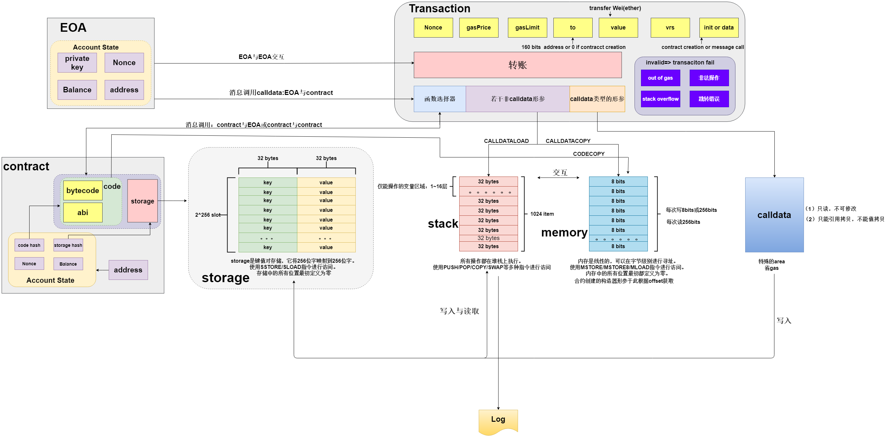
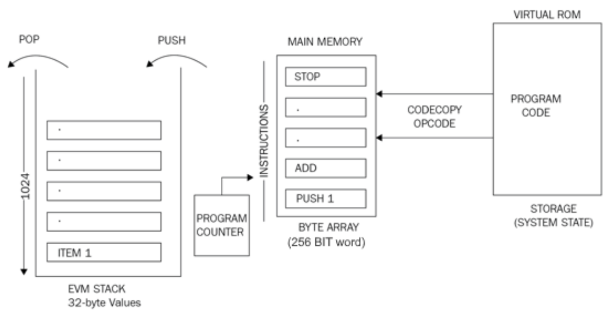
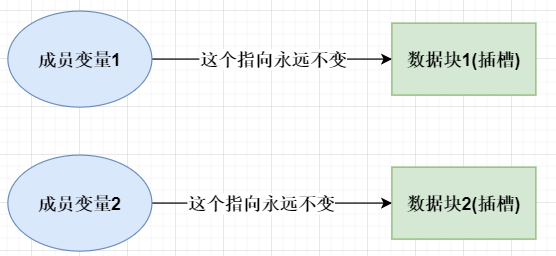
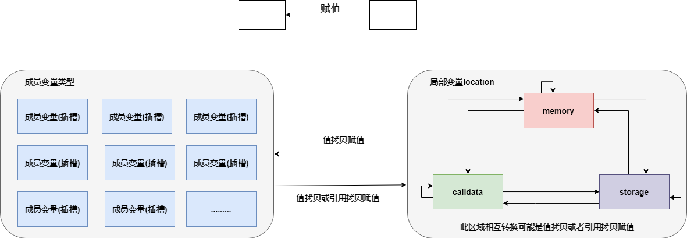
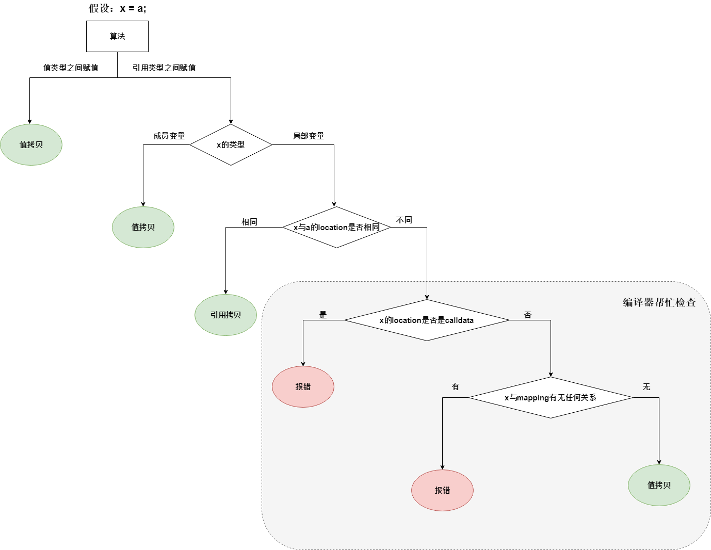

# 结构&拷贝与引用

开始之前，我们约定数据块也叫插槽，也就是storage。

storage是永久存储在区块链上的地方。如果你想操作storage中的数据，你可以将它复制到内存中。然后，所有内存代码都在堆栈上执行。Stack 的最大深度为 1024 个元素，支持 256 位的字长。

## 结构



当定义局部变量时，它存储在内存中，然后压入堆栈以执行。



## 1024栈深

### 简介

- EVM不是寄存器机而是堆栈机，所以所有的计算都在称为堆栈的数据区域上进行。
- 在函数调用过程中
  - memory
    - 用来存放变量、引用、方法或是方法返回值，用来存储函数内存中的数据。
    - 它不做任何运算，只保存临时数据
  - stack
    - 调用合约内部的函数不会增加层数，每一个外部调用（call, callcode, delegatecall, staticcall）都有自己的stack，用来存储参数、返回值和局部变量等。即如果一个调用A拥有自己的stack_A，如果再进行外部调用B，则会新起一个stack_B
    - 每一个局部变量都会占据一级，比如局部变量是bytes1，并不会将32个bytes1拼凑在一起占用一个slot而占据一级
    - 合约无法使用与查看call stack，合约只知道mg.sender和tx.origin，合约无法知道中间是否还有其他合约调用。但是我们在remix的debug中可以看到call调用其他合约的堆栈和内存，这是remix自己搞的功能，它可以访问所有的内容，然而EVM本身是没有这个功能的。想要看到中间调用了哪些外部合约，要进行[contract trace](https://docs.alchemy.com/reference/what-are-evm-traces)。
    - 调用链越深，你需要的插槽就越多，如果你走得太深，你最终会用超1024个插槽，然后报错。通常 1024 个就足够了，除非出现无限递归或者循环过多
    - stack 也叫execution stack，它会执行一系列操作码和运算，其数据来自memory
    - 假如合约A调用自身的方法b()，stack 不会增加级数。用户B调用b()，会增加。合约A调用其他合约的函数，会增加。

### 设计原因

- 具有固定大小使得 EVM 的整体模型更加简单且易于实现
- 如果它非常大，那么执行合约会更昂贵（即需要更多内存）。 1024 是一个非常保守的值，以尽可能安全
- EVM 的设计方式往往会使更大的堆栈变得无用。EVM 只能访问堆栈中前16个slot。因此，即使您有一个 4096 slot的的堆栈，也只能够访问前16个，除非你不断pop，才可以访问到下面更深层次的内容

### 访问限制

对stack的访问仅限于顶端：

- 可以将最顶端的前 16 个元素之一复制到堆栈的顶部：
  - 操作码【PUSH  n】，将第n个slot的内容放入堆栈中，n从 1 到 16
  - 操作码【DUP  n】，复制第n 个堆栈项，n从 1 到16
- 可以将最顶端的元素与前 16 个元素之一交换
  - 操作码【SWAP  n】，交换第 1 个和第n 个堆栈项，其中 n从 1 到 16
- 其他的操作就是正常的stack操作：取栈顶的元素，计算，压回栈顶
  - 正常的pop和push操作

注意：只可以访问前16个元素：状态变量可以无限个，但是局部变量最多16个，局部变量存储在堆栈中，下面是一个例子：

```solidity
contract stackExample {
    function test() public{
        bytes1 a1 = "0";
        bytes1 a2 = "0";
        bytes1 a3 = "0";
        bytes1 a4 = "0";
        bytes1 a5 = "0";
        bytes1 a6 = "0";
        bytes1 a7 = "0";
        bytes1 a8 = "0";
        bytes1 a9 = "0";
        bytes1 a10 = "0";
        bytes1 a11 = "0";
        bytes1 a12 = "0";
        bytes1 a13 = "0";
        bytes1 a14 = "0";
        bytes1 a15 = "0";
        bytes1 a16 = "0";
        bytes1 a17 = "0";
    }
}
```

报错内容：

```
报错内容如下：
from solidity:
aaa.sol:6:9: CompilerError: Stack too deep, try removing local variables.
        uint256 a1 = 0;
        ^--------^
【去掉任何一个变量则不报错，因为局部变量最多16个】
```

2023/24/27更新

```solidity
// SPDX-License-Identifier: MIT
pragma solidity ^0.8.0;
contract stackExample {
    function test() public returns (uint256){
        uint256 a1 = 0;
        uint256 a2 = 0;
        uint256 a3 = 0;
        uint256 a4 = 0;
        uint256 a5 = 0;
        uint256 a6 = 0;
        uint256 a7 = 0;
        uint256 a8 = 0;
        uint256 a9 = 0;
        uint256 a10 = 0;
        uint256 a11 = 0;
        uint256 a12 = 0;
        uint256 a13 = 0;
        uint256 a14 = 0;
        uint256 a15 = 0;
        uint256 a16 = 0;
        uint256 a17 = 0;
        uint256 a18 = 0;
        return a18;
    }
}
//上述合约无法通过编译

// SPDX-License-Identifier: MIT
pragma solidity ^0.8.0;
contract stackExample {
    function test() public returns (uint256){
        uint256 a1 = 0;
        uint256 a2 = 0;
        uint256 a3 = 0;
        uint256 a4 = 0;
        uint256 a5 = 0;
        uint256 a6 = 0;
        uint256 a7 = 0;
        uint256 a8 = 0;
        {uint256 a9 = 0;
        uint256 a10 = 0;
        uint256 a11 = 0;
        uint256 a12 = 0;
        uint256 a13 = 0;
        uint256 a14 = 0;
        uint256 a15 = 0;}
        uint256 a16 = 0;
        uint256 a17 = 0;
        uint256 a18 = 0;
        return a18;
    }
}

//上述合约可以通过编译

// SPDX-License-Identifier: MIT
pragma solidity ^0.8.0;
contract stackExample {
    function test() public{
        uint256 a1 = 0;
        uint256 a2 = 0;
        uint256 a3 = 0;
        uint256 a4 = 0;
        uint256 a5 = 0;
        uint256 a6 = 0;
        uint256 a7 = 0;
        uint256 a8 = 0;
        uint256 a9 = 0;
        uint256 a10 = 0;
        uint256 a11 = 0;
        uint256 a12 = 0;
        uint256 a13 = 0;
        uint256 a14 = 0;
        uint256 a15 = 0;
        uint256 a16 = 0;
        uint256 a17 = 0;
        uint256 a18 = 0;

    }
}
//上述合约可以通过编译
```

### 栈深攻击例子

```solidity
// THIS IS A NEGATIVE EXAMPLE! DO NOT USE!
contract auction {
  address highestBidder;
  uint highestBid;
  function bid() {
    if (msg.value < highestBid) throw;
    if (highestBidder != 0)
      highestBidder.send(highestBid); // refund previous bidder
    highestBidder = msg.sender;
    highestBid = msg.value;
  }
}
```

由于最大堆栈深度为 1024，新投标人始终可以将堆栈大小增加到 1023，然后调用`bid()`，这将导致`send(highestBid)`调用静默失败（即先前的投标人将不会收到退款），但是新的投标人仍将是最高投标人。

## 拷贝与引用

### 特点

- 数据类型
  - 成员变量storage
  - 局部变量
    - 值类型
    - 引用类型
- 局部变量的location
  - memory
  - calldata
  - storage：指向storage
- 消息调用的有效载荷叫做calldata，和location的calldata不是同一个意思！
- 消息调用message的calldata，即有效载荷的部分。message不能被修改，因此location的calldata是只读的。calldata的数据块不能被值拷贝，但是可以进行引用拷贝。也就是说，calldata这个area的数据只能引用message中的数据，或者两个calldata之间相互引用。

- 任何一个成员变量永远都只会指向属于自己的数据块(插槽)，是一对一的关系，不存在一对多、多对一、多对多的情况，如图：



### 图示与算法






### 代码演示

```solidity
pragma solidity ^0.8.0;

contract MemberVatiable{
	int256[] data1;
	int256[] data2;
	
	function getData1() public view returns(int256 memory){
		return data1;
	} 
	
	function getData2() public view returns(uint256 memory){
		return data2;
	}
	
	function insertData1(int256 d) public{
		return data1.push(d);
	}
	
	function insertData2(int256 d) public{
		return data2.push(d);
	}
	
	//1.成员变量都是存放在storage
	//2.storage存储位置的变量之间赋值的时候是值拷贝
	function setData2ToData1() public{
		data1 = data2;//成员变量相互赋值
	}
	
	//成员变量本质上就是插槽，storage layout
	function refAndState_1() public{
		int256p[] storage dataref = data1;//data1和dataref指向同一个数据块(插槽)
		//下面这条语句是引用赋值: data2和dataref指向同一个数据块(插槽)
		dataref = data2;
	}
	
	//成员变量本质上就是插槽，storage layout
	function refAndState_2() public{
		int256p[] storage dataref = data2;//data2和dataref指向同一个数据块(插槽)
		//下面这条语句是值拷贝
		data1 = dataref;
	}
	
	function calldata_ref_right(string calldata name) public{
		string calldata temp = name;//引用拷贝
		name = temp;
	}

    function calldata_copy_wrong(string calldata name) public {
        //calldata不能成为值拷贝目标
        //以下内容报错
        //string memory temp = name;//值拷贝
        //name = temp;
        
        //报错内容：Type string memory is not implicitly convertible to expected type string calldata.
    }
	
	function valueCopy() public{//值类型的数据之间赋值: 只能是值拷贝
		uint v1 = 1;
		uint v2 = 2;
		v1 = v2;
	}
	
	function refCopy() public{//引用类型的数据之间赋值： 
	
		//定义一个引用变量，必须指明他的location，否则报错，例如
        //string x;  ===>  这会报错，应该这么写
        string memory x;//或string calldata x;或string storage x;
        //假如location写成calldata，那么这个变量x就是指向消息调用calldata的一部分calldata
        //注意：location的calldata指的是数据类型的，而消息调用的数据叫做calldata，两者不同
	}
	
	function x_1() public{
		data1 = data2;//值拷贝
	}
	
	function x_2() public{
		int256[] memory temp = new int256[](6);
		data1 = temp;//值拷贝
	}
	
	function x_3() public{
		int256[] memory temp = new int256[](6);
		temp1 = data2;//值拷贝
	}
	
	function x_4() public{
		int256[] storage temp = data1;
		temp = data2;//引用拷贝
	}
	
}
```

- 例子1
  1. 初始状态下，调用insertData1()和insertData2()向data1和data2插入两个数据，结果：getData1()返回[1,1]，getData2()返回[2,2]
  2. 调用setData2ToData1()，结果：getData1()返回[2,2]，getData2()返回[2,2]
  3. 调用insertData1()向data1插入数据1
  4. 结果：getData1()返回[2,2,1]，getData2()返回[2,2]
  5. 调用insertData2()向data2插入数据2
  6. 结果：getData1()返回[2,2,1]，getData2()返回[2,2，2]
  7. 结论：storage存储位置的变量之间赋值的时候是值拷贝

- 例子2
  1. 初始状态下，调用insertData1()和insertData2()向data1和data2插入两个数据，结果：getData1()返回[1,1]，getData2()返回[2,2]
  2. 调用refAndState_2()，结果：getData1()返回[2,2]，getData2()返回[2,2]