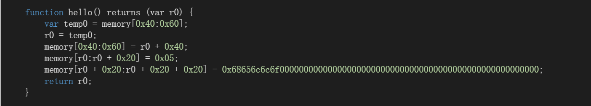
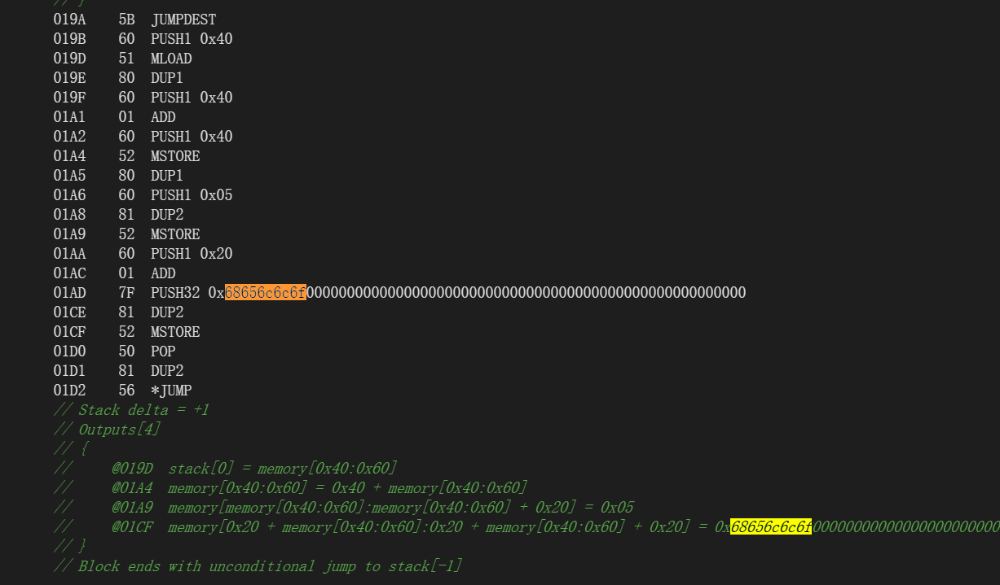
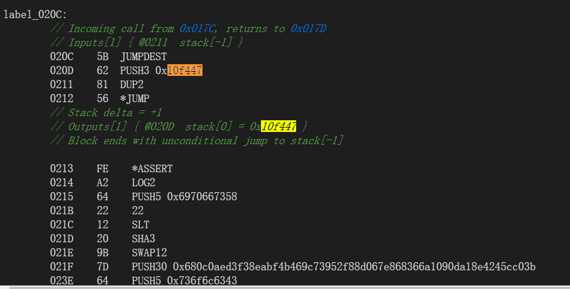

# 插槽&查询链上数据

我们知道，以太坊区块链是公开透明的，那么合约中的任何数据都是可以查询的，即使它是private类型。

## 存储结构

### 简介

State variables of contracts are stored in storage in a compact way such that multiple values sometimes use the same storage slot. Except for dynamically-sized arrays and mappings (see below), data is stored contiguously item after item starting with the first state variable, which is stored in slot `0`. For each variable, a size in bytes is determined according to its type. Multiple, contiguous items that need less than 32 bytes are packed into a single storage slot if possible, according to the following rules:

- The first item in a storage slot is stored lower-order aligned.
- Value types use only as many bytes as are necessary to store them.
- If a value type does not fit the remaining part of a storage slot, it is stored in the next storage slot.
- Structs and array data always start a new slot and their items are packed tightly according to these rules.
- Items following struct or array data always start a new storage slot.

For contracts that use inheritance, the ordering of state variables is determined by the C3-linearized order of contracts starting with the most base-ward contract. If allowed by the above rules, state variables from different contracts do share the same storage slot.

The elements of structs and arrays are stored after each other, just as if they were given as individual values.

### 注意事项

When using elements that are smaller than 32 bytes, your contract’s gas usage may be higher. This is because the EVM operates on 32 bytes at a time. Therefore, if the element is smaller than that, the EVM must use more operations in order to reduce the size of the element from 32 bytes to the desired size.

It might be beneficial to use reduced-size types if you are dealing with storage values because the compiler will pack multiple elements into one storage slot, and thus, combine multiple reads or writes into a single operation. If you are not reading or writing all the values in a slot at the same time, this can have the opposite effect, though: When one value is written to a multi-value storage slot, the storage slot has to be read first and then combined with the new value such that other data in the same slot is not destroyed.

When dealing with function arguments or memory values, there is no inherent benefit because the compiler does not pack these values.

Finally, in order to allow the EVM to optimize for this, ensure that you try to order your storage variables and `struct` members such that they can be packed tightly. For example, declaring your storage variables in the order of `uint128, uint128, uint256` instead of `uint128, uint256, uint128`, as the former will only take up two slots of storage whereas the latter will take up three.

> Note
>
> The layout of state variables in storage is considered to be part of the external interface of Solidity due to the fact that storage pointers can be passed to libraries. This means that any change to the rules outlined in this section is considered a breaking change of the language and due to its critical nature should be considered very carefully before being executed. In the event of such a breaking change, we would want to release a compatibility mode in which the compiler would generate bytecode supporting the old layout.

## 插槽简介

- storage类型的数据被永久存储，以键值对的形式存储在 slot 插槽中。这就是为什么使用存储非常昂贵的原因。
- 占用 256 位插槽的 gas 成本为 20,000 gas。
- 修改 storage 将花费 5,000 gas 。
- 清理存储插槽时（即将非零字节设置为零），将退还一定量的 gas 。
- EVM的存储大小（storage）共有 2^256 个插槽，每个插槽 32 个字节
- 部署一个合约，如果合约继承了父类，那么slot从父类开始算起。下面是一个例子：

部署合约B。合约B的slot 0 => a，slot 1 => b

```solidity
contract A{
	uint256 public a = 1;
}

contract B is A{
	uint256 public b = 2;
}
```

## 查询非引用类型

### 原理


### 例子

查询password的值

```solidity
contract Defuse{
    bool public Explode = false;//slot0
    address public launcherAddress;//slot0
    bytes32 private password;//slot1
    bool public powerState = true;
    bytes4 constant launcher_start_function_hash = bytes4(keccak256("changedeadline(uint256)"));
    Launcher launcher;
    
	......
}
```

- 使用hardhat进行查询

- 在hardhat.config.js输入配置信息：goerli测试网络

```js
//使用alchemy的服务商来设置goerli网络
const GOERLI_API_URL = "https://eth-goerli.g.alchemy.com/v2/AaEomr1g_2UC3GX_7J4XbxvvjKtn6UAi";
const PRIVATE_KEY = "??????????????????????????????????????????????";

module.exports = {
  solidity: "0.8.9",
  networks: {
    goerli: {
      url: `${GOERLI_API_URL}`,
      accounts: [`${PRIVATE_KEY}`]
    }
  },
};
```

命令行输入以下内容查询

- npx hardhat
- npx hardhat console --network goerli
- await ethers.provider.getStorageAt('0x2fcBD94F43B7795583E36a79883f9D83E39FcBe3',0)
- await ethers.provider.getStorageAt('0x2fcBD94F43B7795583E36a79883f9D83E39FcBe3',1)

参数0:slot0。参数1:slot1，即password的值


## 查询引用类型

### 定长数组

定长数组中的每个元素都会有一个独立的插槽来存储。以一个含有三个 uint64 （8字节）元素的定长数组为例，下图可以清楚的看出其存储方式：


### 变长数组

#### 原理

 一般来说，编码与 `bytes1[]` 类似，即有一个槽用于存放数组本身和一个数据区， 这个数据区是用该槽的位置的 `keccak256` 哈希值计算的。 然而，对于较短的值（短于32字节），数组元素与长度一起存储在同一个槽中。

变长数组会先启用一个新的插槽 slotA 用来存储数组的长度 length ，slotA 是变长数组声明位置对应的插槽，其具体数据存储在另外的编号为 slotV 的插槽中。变长数组在编译期间无法知道数组的长度，没办法提前预留存储空间，所以 Solidity 就用 slotA 位置存储了变长数组的长度。

- slot A => length
- slotV = keccak256(slotA) + index

如果有类似的方法，map是动态数组。如果map覆盖了2^256个插槽的位置（全部位置），那么可以修改map的内容，即修改此合约的任意插槽内容。注意：我们的修改是在此动态数组第一个元素实际位置开始算的而不是从slot 0开始算！即如果我们传入参数0和1，那么就是修改插槽keccak256(slot map) + 0的元素【即map[1]被修改了】；传入参数1和2，那么就是修改插槽keccak256(slot map) +1的元素【即map[2]被修改了】。

```solidity
    function set(uint256 key, uint256 value) public {
        // Expand dynamic array as needed
        if (map.length <= key) {
            map.length = key + 1;
        }

        map[key] = value;
    }
```

如果我们想修改slot 0，那么就需要计算偏移量：比如一下例子，我们假设map定义在slot 1：

```solidity
pragma solidity ^0.8.17;
contract MyContract {

    uint256 public maxUint256 = type(uint256).max;//115792089237316195423570985008687907853269984665640564039457584007913129639935
    uint256 public isCompleteSlot = maxUint256 - 0xb10e2d527612073b26eecdfd717e6a320cf44b4afac2b0732d9fcbe2b7fa0cf6;
    
    function x() public pure returns(bytes32){
        bytes32 y = keccak256(abi.encode(0x0000000000000000000000000000000000000000000000000000000000000001));
        return y;
    }//0xb10e2d527612073b26eecdfd717e6a320cf44b4afac2b0732d9fcbe2b7fa0cf6
}
//isCompleteSlot=35707666377435648211887908874984608119992236509074197713628505308453184860938
//maxUint256 = 115792089237316195423570985008687907853269984665640564039457584007913129639935
//keccak256(1) = 0xb10e2d527612073b26eecdfd717e6a320cf44b4afac2b0732d9fcbe2b7fa0cf6
//slot 0 == slot isComplete == 2^256
//keccak256(1) + offset ==  2^256
//offset == 2^256 - keccak256(1)
```

计算出来的offset就是isCompleteSlot，即slot 0的位置

#### 例子1

我们声明的user位于slot 0，而user的第一个元素则需要计算：slotV = keccak256(slot0) + 0。（假如有第二个元素，则位于slotV = keccak256(slot0) + 1）


得到0x290decd9548b62a8d60345a988386fc84ba6bc95484008f6362f93160ef3e563：

```solidity
pragma solidity ^0.4.11;
contract MyContract {
    
    function x() public pure returns(bytes32){
        bytes32 y = keccak256(abi.encode(0x0000000000000000000000000000000000000000000000000000000000000000));
        return y;
    }
}
//x()输出：0x290decd9548b62a8d60345a988386fc84ba6bc95484008f6362f93160ef3e563
```

#### 例子2

```solidity
pragma solidity ^0.8.0;

contract haha{
  
  uint[] user;

  function addUser(uint a) public returns (bytes memory){
    user.push(a);
    return abi.encode(user);
  }
}
```

部署这个合约后调用 addUser 函数并传入参数 a = 998，debug 后可以看出变长数组的存储方式：


- slot 0的key=0x0000000000000000000000000000000000000000000000000000000000000000,value = 1
  - slot 0 存储着user的元素个数length = 1
  - keccak256(0x0000000000000000000000000000000000000000000000000000000000000000) = 0x290decd9548b62a8d60345a988386fc84ba6bc95484008f6362f93160ef3e563
- user的第1个元素
  - slot V = keccak256(slot0) + 0
  - slot V = keccak256(0x0000000000000000000000000000000000000000000000000000000000000000) + 0 = 0x290decd9548b62a8d60345a988386fc84ba6bc95484008f6362f93160ef3e563，则998存储在这
  - 注意：0x510e4e770828ddbf7f7b00ab00a9f6adaf81c0dc9cc85f1f8249c256942d61d9是keccak256(0x290decd9548b62a8d60345a988386fc84ba6bc95484008f6362f93160ef3e563)的结果

我们再调用一次 addUser 函数并传入 a=999 可以得到下面的结果：


- user的第2个元素
  - slot V = keccak256(slot0) + 1
  - slot V = keccak256(0x0000000000000000000000000000000000000000000000000000000000000000) + 1 = 0x290decd9548b62a8d60345a988386fc84ba6bc95484008f6362f93160ef3e564，则998存储在这
  - 注意：0x6c13d8c1c5df666ea9ca2a428504a3776c8ca01021c3a1524ca7d765f600979a是keccak256(0x290decd9548b62a8d60345a988386fc84ba6bc95484008f6362f93160ef3e564)的结果

#### 例子3

```solidity
contract Vault {
    uint public count = 123;
    address public owner = msg.sender;
    bool public isTrue = true;
    uint16 public u16 = 31;
    bytes32 private password;
    uint public constant someConst = 123;
    bytes32[3] public data;

    struct User {
        uint id;
        bytes32 password;
    }
    User[] private users;
    mapping(uint => User) private idToUser;

    constructor(bytes32 _password) {
        password = _password;
    }

    function addUser(bytes32 _password) public {
        User memory user = User({id: users.length, password: _password});

        users.push(user);
        idToUser[user.id] = user;
    }

    function getArrayLocation(
        uint slot,
        uint index,
        uint elementSize
) public pure returns (uint) {
        return uint(keccak256(abi.encodePacked(slot))) + (index * elementSize);
    }

    function getMapLocation(uint slot, uint key) public pure returns (uint) {
        return uint(keccak256(abi.encodePacked(key, slot)));
    }
}
```

slot 0 ===> `uint public count = 123;`


slot 1 ===> `address public owner = msg.sender;`和`bool public isTrue = true;`和`uint16 public u16 = 31;`


从右往左依次为

- owner = f36467c4e023c355026066b8dc51456e7b791d99
- isTrue = 01 = true
- u16 = 1f = 31

slot 2 ===> `bytes32 private password;`


【无法查询 `uint public constant someConst = 123;`，因为他被标注为了constant，写进了字节码】

slot 3 ，slot 4，slot 5 ===> `bytes32[3] public data;`，存储定长数组的三个元素


slot 6 ===> `User[] private users;`


在合约中，结构体User中又id和password，在动态数组users中，是按照顺序存储的。例如：用户1的id，用户1的password，用户2的id，用户2的password……。下面我们来读取两个用户的 id 和 password：

**user1**


**user2**


> 0xf652222313e28459528d920b65115c16c04f3efc82aaedc97be59f3f377c0d3f是如何计算出来的呢？
>
> keccak256(bytes32(slot))来算出。本处的动态数组users所在的插槽是slot6，则：keccak256(abi.encode(0x0000000000000000000000000000000000000000000000000000000000000006))。下图是remix验证的结果：


我们发现：键值对是按照顺序一个一个排列的3f-40-41-42

#### 例子4

```solidity
pragma solidity ^0.4.11;

contract C {
	uint128[] s;

	function C() {
		s.length = 4;
		s[0] = 0xAA;
		s[1] = 0xBB;
		s[2] = 0xCC;
		s[3] = 0xDD;
	}
}
```

在 Remix 中运行这个，最后的存储是这样的：

```
key: 0x0000000000000000000000000000000000000000000000000000000000000000
value: 0x0000000000000000000000000000000000000000000000000000000000000004

key: 0x290decd9548b62a8d60345a988386fc84ba6bc95484008f6362f93160ef3e563
value: 0x000000000000000000000000000000bb000000000000000000000000000000aa

key: 0x290decd9548b62a8d60345a988386fc84ba6bc95484008f6362f93160ef3e564
value: 0x000000000000000000000000000000dd000000000000000000000000000000cc
```

正如预期的那样，只使用了 3 个存储槽。长度再次存储在 `0x0`，即存储变量的位置。四个项打包在两个独立的存储槽中。

### mapping

#### 原理

mapping的value实际存储位置计算公式：keccak256(bytes32(key)+bytes32(slot))

```solidity
//mapping的value实际存储位置计算公式：keccak256(bytes32(key)+bytes32(slot))
function getStorageLocationForKey(address _key) public pure returns(bytes32) {
        // _key : mapping 的 key
        // 0 : 我们的balances这个mapping位于slot 0 
        // 如果部署slot 0，那么换成对应的slot 就ok了
        return keccak256(abi.encode(_key, 0));
    }
```

#### 例子1

```solidity
//SPDX-License-Identifier: GPL-3.0
pragma solidity ^0.4.24;

contract MyToken {
    mapping(address => uint256) balances; // slot 0
    
    constructor() {
        //msg.sender = 0xd3E65149C212902749D49011B6ab24bba30D97c6
        balances[msg.sender] = 10;
    }

    function getStorageLocationForKey(address _key) public pure returns(bytes32) {
        // _key : mapping 的 key
        // 0 : 我们的balances这个mapping位于slot 0 
        return keccak256(abi.encode(_key, 0));
    }

}
```


#### 例子2

```solidity
// SPDX-License-Identifier: GPL-3.0
pragma solidity >=0.4.0 <0.9.0;


contract C {
    struct S { uint16 a; uint16 b; uint256 c; }
    uint x;
    mapping(uint => mapping(uint => S)) data;
}
```

让我们计算一下 `data[4][9].c` 的存储位置。 映射本身的位置是 `1` （变量 `x` 前面有32字节）。 这意味着 `data[4]` 存储在 `keccak256(uint256(4) . uint256(1))`。 `data[4]` 的类型还是一个映射， `data[4][9]` 的数据从 `keccak256(uint256(9) . keccak256(uint256(4) . uint256(1)))` 槽开始。 成员 `c` 在结构 `S` 中的槽位偏移是 `1`，因为 `a` 和 `b` 被装在一个槽位中。 这意味着 `data[4][9].c` 的插槽是 `keccak256(uint256(9) . keccak256(uint256(4) . uint256(1))) + 1`。 该值的类型是 `uint256`，所以它占用一个槽。

另外，数组数据从 `keccak256(p)` 开始，它的排列方式与静态大小的阵列数据相同： 一个元素接着一个元素，如果元素的长度不超过16字节， 就有可能共享存储槽。

### string&bytes

`bytes` 和 `string` 的编码是相同的。 一般来说，编码与 `bytes1[]` 类似，即有一个槽用于存放数组本身和一个数据区， 这个数据区是用该槽的位置的 `keccak256` 哈希值计算的。 然而，对于较短的值（短于32字节），数组元素与长度一起存储在同一个槽中。

特别是：如果数据最多只有 `31` 字节长， 元素被存储在高阶字节中（左对齐），最低阶字节存储值 `length * 2`。 对于存储数据长度为 `32` 或更多字节的字节数，主槽 `p` 存储 `length * 2 + 1`， 数据照常存储在 `keccak256(p)`。这意味着您可以通过检查最低位是否被设置来区分短数组和长数组： 短数组（未设置）和长数组（设置）。

为什么要将长度编码？因为它的完成方式，有一个简单的方法来测试一个字节数组是短的还是长的。请注意，长数组的编码长度总是奇数，短数组则是偶数。汇编代码只需要查看最后一位，看看它是零（偶数/短）还是非零（奇数/长）。

#### 例子1

小于等于31字节的数据

```solidity
pragma solidity 0.5.4;

contract AssemblyString {
    string public s = "ether"; //slot 0
}
```

查询插槽0：0x657468657200000000000000000000000000000000000000000000000000000a

- 0x6574686572 等于“ether”
- 0xA 等于十进制的 10。（ether 有 5 个字母，那么 5 乘以 2 等于 10）

#### 例子2

查询大于等于32字节的数据

```solidity
pragma solidity 0.5.4;

contract AssemblyString {
    string s = "aaaaaaaaaaaaaaaaaaaaaaaaaaaaaaaaaaaaaaaaaaaaaaaaaaaaaaaaaaa"; //slot 0
}
```

查询插槽0：0x0000000000000000000000000000000000000000000000000000000000000077，换算成十进制即119，即119=59*2+1

我们的实际数据存储在：test = 0x290decd9548b62a8d60345a988386fc84ba6bc95484008f6362f93160ef3e563

```js
async function z(){
    var test = await web3.utils.keccak256('0x0000000000000000000000000000000000000000000000000000000000000000') 
    console.log(test)
}
```

查询插槽0x290decd9548b62a8d60345a988386fc84ba6bc95484008f6362f93160ef3e563与0x290decd9548b62a8d60345a988386fc84ba6bc95484008f6362f93160ef3e564（因为数据太长，数据依次存储）：

0x6161616161616161616161616161616161616161616161616161616161616161
0x6161616161616161616161616161616161616161616161616161610000000000

```js
async function y(){
    var slot1 = await web3.eth.getStorageAt("0xeB488d24209f01F66AAd1AC96791ce999c04583E",
    "0x290decd9548b62a8d60345a988386fc84ba6bc95484008f6362f93160ef3e563")
    var slot2 = await web3.eth.getStorageAt("0xeB488d24209f01F66AAd1AC96791ce999c04583E",
    "0x290decd9548b62a8d60345a988386fc84ba6bc95484008f6362f93160ef3e564")
    console.log(slot1)
    console.log(slot2)
}
```

## 查询constant类型

### 原理

常量不存储在任何地方。在编译时的每次使用中，它们都被替换为常量值。

例如下面的代码。请注意，当我从函数返回常量时，它提示我可以使用`pure`修饰符而不是`view`，因为没有可从存储中读取的内容，因为`100`常量的值将直接在函数中使用。说明这100并不会上链，它在编译的时候就作为一个值使用，而不存储到一个变量里面（因此节省了gas）

```solidity
// SPDX-License-Identifier: MIT
pragma solidity 0.8.17;

contract Example {

    uint256 constant VALUE = 100;

    function getValue() public pure returns(uint256) {
        return VALUE;   
    }

}
```

编译后会是这样的：

```solidity
// SPDX-License-Identifier: MIT
pragma solidity 0.8.17;

contract Example{

    function getValue() public pure returns(uint256) {
        return 100;   
    }

}
```

### 例子1

合约

```solidity
contract Vault {
    uint public count = 123;
    address public owner = msg.sender;
    bool public isTrue = true;
    uint16 public u16 = 31;
    bytes32 private password = 0;
    uint public constant testGame1 = 112233;//1B669
    uint public constant testGame3 = 223344;//36870
    uint public constant testGame2 = 1122;//462
    uint public constant abcabcabc = 3344;//D10
    uint public constant testGame4 = 1111111;//10F447
    uint public constant testGame5 = 2222222;//21E88E
    uint public constant testGame6 = 3333333;//32DCD5
    bytes32[3] public data;

    struct User {
        uint id;
        bytes32 password;
    }
    User[] private users;
    mapping(uint => User) private idToUser;

    .........
}
```

在字节码中查找这些常量数值如下图：


根据这一串数字，并无法找到变量名的规则，因此我猜测：编译器隐去了变量名，而直接将常量作为一个值直接编译，用到的地方就直接赋值。`565b6`和`81565b6`包围的内容是常量，但规则很离奇，常量前面有1~几位不确定的占位符

> 注意：
>
> bytecode发现：常量数值前面一定有（不相邻）565b6，后面一定是 81565b6。
>
> 但这个 565b6，81565b6 也在其他地方出现了。 
>
> 目前可以这么认为：常量前面一定有 565b6，后面一定跟着 81565b6。但 565b6 后面不一 定是常量，81565b6 前面不一定是常量

`565b6`在bytecode如图：


`81565b6`如图：


ABI中：常量都是使用PUSH。格式：`PUSH3 数值`。如图是其中5个PUSH3。


### 例子2

```solidity
//部分代码
contract Vault {
    uint256 public constant testGame6 = 3333333;//32DCD5
 	....

    function yyy() public returns(uint256){
        return testGame6;
    }

    function yyy1() public returns(uint256){
        return testGame6;
    }

	.....
}
```

搜索关键字：32DCD5


再结合原理，我们可以推断：常量不存储在任何地方。在编译时的每次使用中，它们都被替换为常量值。一共出现6次32DCD5

bytecode中三次：

- 一次是初始定义的时候
- 一次是yyy函数用到了常量
- 一次是yyy1函数用到了常量。

在操作码中三次：

- 一次是初始定义的时候PUSH3
- 一次是yyy函数用到了常量PUSH3
- 一次是yyy1函数用到了常量PUSH3

### 例子3

```solidity
// SPDX-License-Identifier: GPL-3.0

pragma solidity >=0.7.0 <0.9.0;
contract Test{
    string public constant hello = "hello";
    string public constant world = "world";
    uint256 public constant testGame6 = 3333333;//32DCD5
    uint256 public constant testGame4 = 1111111;//10F447
}
```


从这里我们又判断：`PUSH32`是字符串的操作码，`PUSH3`是数值的操作码

### 反编译

[网站](https://ethervm.io/decompile)。我们将下面的代码部署到goerli测试网，然后在这个网站反编译。

```solidity
// SPDX-License-Identifier: GPL-3.0

pragma solidity >=0.7.0 <0.9.0;
contract Test{
    string public constant hello = "hello";
    string public constant world = "world";
    uint256 public constant testGame6 = 3333333;//32DCD5
    uint256 public constant testGame4 = 1111111;//10F447
}
```

**string public constant hello = "hello";**

方法名就是常量名





**string public constant world = "world";**

方法名就是常量名


**uint256 public constant testGame6 = 3333333;//32DCD5**

无法得知常量名


**uint256 public constant testGame4 = 1111111;//10F447**

无法得知常量名




这下简单了，如果想要获取constant类型的变量，只需要合约地址

将合约地址传入这个反编译网站。ctrl+f，搜索PUSH3和PUSH32，就可以找到对应的常量值是多少。

字符串常量的名字可以根据方法名得到：方法名就是常量名。但是有时候也会出bug，得不到常量名。（有人怀疑是不是因为我将变量名和值都设置为hello，碰巧了？当然不是，我也将变量名设置为hello1过，然后方法名是hello1）

很可惜，无法得知数值常量的变量名

总结，技术上想得到常量名肯定是行得通的，但这需要比较高的技术。

### ethersjs调用常量

Greeter.sol

```solidity
//SPDX-License-Identifier: Unlicense
pragma solidity ^0.8.9;

contract Greeter {
    string public constant name ="hello";
}
```

deploy.js

```js
const hre = require("hardhat");

async function main() {
  const Greeter = await hre.ethers.getContractFactory("Greeter");
  const greeter = await Greeter.deploy();
  await greeter.deployed();
  console.log("Greeter deployed to:", greeter.address);

  const _name = await greeter.name();//获取常量值
  console.log("name",_name);
}

main();
```

Greeter.js

```js
const { expect } = require("chai");
const { ethers } = require("hardhat");

contract("Greeter", (accounts) => {
  it("get constant name", async function () {
    const address = '0x84B9E3f46871C2C7cbD01e19D6Fd68a4601fced5';
    const greeterContract = await ethers.getContractAt("Greeter", address);  
    assert.equal(await greeterContract.name(), "hello");
  });
});
```


contract: 0x84B9E3f46871C2C7cbD01e19D6Fd68a4601fced5

通过js获取常量值：`const _name = await greeter.name();`

### 总结

- 技术上想得到常量名肯定是行得通的，但这需要比较高的技术
- `PUSH32`是字符串的操作码，`PUSH3`是数值的操作码。这两个操作码是常量特有的操作码。
- 定义常量时，会在bytecode中显示一次，在操作码中一次
- 函数使用到n次常量，就会在bytecode中显示n次，在操作码中n次
- 编译器隐去了变量名，而直接将常量作为一个值直接编译，用到的地方就直接赋值。`565b6`和`81565b6`包围的内容是常量，但规则很离奇，常量前面有1~几位不确定的占位符。常量数值前面有（不相邻）565b6，后面是 81565b6。目前可以这么认为：常量前面有 565b6，后面跟着 81565b6。但 565b6 后面不一 定是常量，81565b6 前面不一定是常量。**这个规律并不是普遍的**。
- 按道理：无法从bytecode和ABI中还原常量的变量名，因为常量被硬编码到字节码中，它们不是变量，不占用任何存储空间，也不会进入 ABI，常量名被编译器丢弃了，编译器只需要那个具体的值。因此无法对应找到常量名，顺序不一致，如下图。但是反编译却有时候可以反编译出常量名，真很奇怪，想不明白。先放着，继续学，没准以后学深了自然懂了

