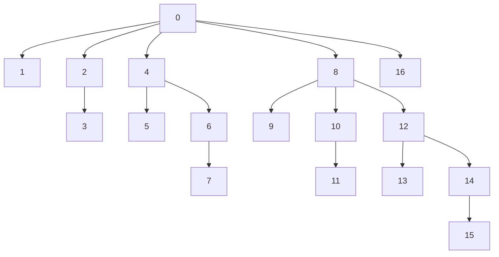

## 1.简介

- 定义：Fenwick Tree是一个算法/数据结构，中文叫做二元索引树（Binary Indexed Tree, BIT）。
- 使用场景：高效计算数列的前缀和， 区间和。
- 复杂度：
  - Prefix Sum Queries: O(logn)
  - Point Updates: O(logn)
  - Range Updates: O(logn)
  - Build a Fenwick Tree: O(nlogn)
  - Space complexity: O(n)

## 2.演变、故事与推理

### 2.1求和 vs 前缀和

给一个数组A，我们需要算它某个区块的和，比如A[1, 3]的和，普通方法是累加：SUM=5+8+3=16。

```
A = [7, 5, 8, 3, -4, 6, 9, 2]
```

但是这样太慢了，因此我们使用前缀和的方式进行改进：引入数组B，它每个元素的值是前n项和。比如：

- B[0]=A[0], 
- B[1]=A[0]+A[1]=B[0]+A[1]
- B[2]=A[0]+A[1]+A[2]=B[1]+A[2]
- B[3]=A[0]+A[1]+A[2]+A[3]=B[2]+A[3]

```
A = [7, 5,  8,  3,  -4, 6,  9,  2 ]
B = [7, 12, 20, 23, 19, 25, 34, 36]
```

这样我们就可以快速得到某个区间的和。原理是：每个区间，可以用大区间减去小区间得到。比如：A[1, 3] = B[3] - B[0] = 23 - 7 = 16。

上面的算法，复杂度如下：

```
累加：
- 修改：O(1)
- 求和：O(n)

前缀和：
- 修改：O(n)
- 求和：O(1)
```

各有优劣，但我们想找一个更好的方式，复杂度介于之间。

### 2.2二元索引树

比如下图是一个根据A数组已经构建好的Fenwick Tree，我们定义一些概念：

- A：数组
- Sn：第n号节点到根节点的路径权重总和。为A的前n项和
- BITi：第i号节点的权重

举个例子：S2=BIT2, S5=BIT5+BIT4, S7=BIT7+BIT6+BIT4。




## 3.原理

### 3.1前n项和

先来看一些概念：

- 最小位元：Least Significant Bit(LSB)，也就是二进制表示法下最右边的1。比如：01001中的从左往右数的第二个1；011101中的从左往右数的第四个1
- 下面的表示图中，每个`|`表示负责的范围，从自身往下数。比如12的`|`负责的范围是[9,10,11,12]，8的`|`负责的范围是[1,2,3,4,5,6,7,8]

```
16   10000         |
15   01111 |       |
14   01110   |     |
13   01101 | |     |
12   01100     |   |
11   01011 |   |   |
10   01010   | |   |
09   01001 | | |   |
08   01000       | |
07   00111 |     | |
06   00110   |   | |
05   00101 | |   | |
04   00100     | | |
03   00011 |   | | |
02   00010   | | | |
01   00001 | | | | |
```

可以发现我们Sn的计算可以体现在成这样，比如：S7=BIT7+BIT6+BIT4，就像一个线从上往下拉下去。这个从上往下拉的行为，在二进制中等价于移除最小位元。比如：

- 7：00111，移除最小位元为00110
- 6：00110，移除最小位元为00100
- 4：00100，移除最小位元为00000
- 0：00000，结束

```
07   00111 |
06   00110   |
05   00101   |
04   00100     |
03   00011     |
02   00010     |
01   00001     |
```

### 3.2单点修改

如果要修改某个节点x，那么我们就需要找到所有受到影响的节点：x本身，节点负责区间覆盖到x的那些节点。比如6号节点要修改，那么就在第六行划一条横线，由`|`变成`+`。所有负责区间包括`+`的节点都需要修改。因此，6号修改之后，8号和16号节点也要进行修改。

```
16   10000         |
15   01111 |       |
14   01110   |     |
13   01101 | |     |
12   01100     |   |
11   01011 |   |   |
10   01010   | |   |
09   01001 | | |   |
08   01000       | |
07   00111 |     | |
06   00110   +   + +
05   00101 | |   | |
04   00100     | | |
03   00011 |   | | |
02   00010   | | | |
01   00001 | | | | |
```

我们可以发现一个规律：求前缀和的时候，需要一直移除最小位元，直到索引值变成0。但是在单点修改的时候，我们需要一直增加最小位元，直到索引值超出A数组的长度范围。

比如：我们要修改第9号元素

- 09：01001，最小位元是1，9+1=10
- 10：01010，最小位元是2，10+2=12
- 12：01100，最小位元是4，12+4=16
- 16：10000，最小位元是16，16+16=32
- 32：大于A数组的长度范围，结束

```
16   10000         |
15   01111 |       |
14   01110   |     |
13   01101 | |     |
12   01100     |   |
11   01011 |   |   |
10   01010   | |   |
09   01001 + + +   +
08   01000       | |
07   00111 |     | |
06   00110   |   | |
05   00101 | |   | |
04   00100     | | |
03   00011 |   | | |
02   00010   | | | |
01   00001 | | | | |
```

### 3.3伪代码

A.length = 16:

```
N = 16
BIT = [0] * N
```

Prefix Sum Queries:

```python
def query(i):
	sum = 0
	while i > 0:
		sum += BIT[i]
		i -= LSB(i)
	return sum
```

Point Updates:

```python
def update(i, delta):
  while i <= N:
    BIT[i] += delta
    i += LSB(i)
```

LSB:

```python
def LSB(x):
  return x & -x;
```

## 4.DeFi中的实操应用

### 4.1分析

这个代码来自cantina的[Alchemix / alchemix-v3](https://cantina.xyz/competitions/e68909e6-3491-4a94-a707-ecf0c89cf72a)审计比赛。以区块跟踪质押的进展。它通过使用Fenwick Tree来高效管理和查询系统中所有质押的总可赎回金额，记录质押金额在指定区块范围内的变化，并计算任意区块范围内已标记的质押总量。

- 变量：
  - `DELTA_BITS = 112`：分配给存储差分值（质押变化）的位数。
  - `DELTA_MASK = (2**112) - 1`：用于隔离 256 位存储槽中差分值的位掩码。
  - `DELTA_SIGNBIT = 2**(112 - 1)`：差分值的符号位，用于判断值是否为负。
  - `PRODUCT_BITS = 256 - DELTA_BITS = 144`：分配给存储乘积值（质押金额乘以区块号）的位数。
  - **范围限制**：
    - `DELTA_MAX = 2112 - 1` 和 `DELTA_MIN = -2112`：差分值的最大和最小值。
    - `PRODUCT_MAX = 2144 - 1` 和 `PRODUCT_MIN = -2144`：乘积值的最大和最小值。
  - `GRAPH_MAX = 2(144 - 112) = 232`：图的最大区块跨度（约 42.9 亿个区块），由位分配推导得出。

- 用一个单一的结构体 Graph 来表示 Fenwick 树：

```solidity
struct Graph {
    uint256 size; // 当前树的大小，必须是 2 的幂
    // 固定大小的数组，存储 Fenwick 树节点
    // 一个数组，每个元素存储一个打包的 256 位值，包含差分（112 位）和乘积（144 位）。
    // 数组采用一索引（因此为 GRAPH_MAX + 1），索引 0 未使用，以简化 Fenwick 树操作。
    uint256[GRAPH_MAX + 1] g; 
}
```

#### 4.1.1update

从 index + 1 开始，使用 Fenwick 树逻辑（index += index & -index）更新所有受影响的节点。

```solidity
function update(
	uint256[GRAPH_MAX + 1] storage graph, 
	uint256 index,     // 
	uint256 treeSize,  // 
	int256 delta,      // 质押金额的变化（增量或减量）
	int256 deltaProd   // 质押变化量与区块号的乘积（delta * block），用于计算区块范围内的累积质押
) private
```

将当前 256 位槽解包为 ad（差分）和 ap（乘积）。

```solidity
  //graph[index] += delta on 2 packed values
  uint256 packed = graph[index];
  int256 ad;
  int256 ap;

  //unpack values
  if ((packed&DELTA_SIGNBIT) != 0) {
      ad = int256(packed | ~DELTA_MASK); //extend set sign bit
  } else {
      ad = int256(packed & DELTA_MASK); //extend zero sign bit
  }
  ap = int256(packed)>>DELTA_BITS; //automatic sign extension
```

将 delta 加到 ad，将 deltaProd 加到 ap。

```solidity
  ad+=delta;
  ap+=deltaProd;
```

验证新值是否在 `DELTA_MAX/MIN` 和 `PRODUCT_MAX/MIN` 范围内。

```solidity
  //pack and store new values
  require(ad <= DELTA_MAX && ad >= DELTA_MIN);
  require(ap <= PRODUCT_MAX && ap >= PRODUCT_MIN);
  graph[index] = (uint256(ad)&DELTA_MASK)|uint256(ap<<DELTA_BITS);
```

#### 4.1.2addStake

```solidity
function addStake(
	Graph storage g,
	int256 amount,     // 质押金额的变化（必须在 DELTA_MIN 和 DELTA_MAX 之间）
	uint256 start,     // 质押开始的区块
	uint256 duration   // 质押持续的区块数
) internal
```

确保 `amount` 在 `DELTA_MIN` 和 `DELTA thụ_MAX` 范围内。检查 `start` 和 `expiration（start + duration）`小于 `GRAPH_MAX - 1`。

```solidity
  require(amount <= DELTA_MAX && amount >= DELTA_MIN);
  require(start < GRAPH_MAX-1);
```

如果质押范围超过当前树大小（`g.size`），将树扩展到能够容纳 `expiration + 2` 的下一个 2 的幂。扩展过程包括将最后一个值复制到新位置，以保持树的一致性。

```solidity
  uint256 newSize = expiration + 2;
  if (newSize >= graphSize) {
      //round expiration up to the next power of 2
      newSize |= newSize >> 1;
      newSize |= newSize >> 2;
      newSize |= newSize >> 4;
      newSize |= newSize >> 8;
      newSize |= newSize >> 16;
      if (GRAPH_MAX > 2**32) {//handle GRAPH_MAX > 32-bit
          newSize |= newSize >> 32;
          newSize |= newSize >> 64;
          newSize |= newSize >> 128;
      }
      newSize++;

      require (newSize <= GRAPH_MAX);

      if (graphSize != 0) {
          //if the graph isn't null, copy the last entry up to the new end
          uint256 copy = g.g[graphSize];
          while (graphSize <= newSize) {
              g.g[graphSize] = copy;
              graphSize += graphSize;
          }
      }
      graphSize = newSize;
      g.size = newSize;
  }
```

下面这些更新表示质押在开始时增加，在结束时减少。

```solidity
  //update tree storage with deltas, revert if results cannot be packed into storage
  update(g.g, start + 1, graphSize, amount, amount * int256(start));
  update(g.g, expiration + 1, graphSize, -amount, -amount * int256(expiration));
```

> 比如：添加一个从区块 10 开始、持续 5 个区块的 100 单位质押：
>
> - 在区块 11 更新：delta = 100，deltaProd = 100 * 10 = 1000。
> - 在区块 16 更新：delta = -100，deltaProd = -100 * 15 = -1500。

#### 4.1.3queryStake

查询两个区块之间标记的质押总量。

```solidity
function queryStake(Graph storage g, uint256 start, uint256 end) internal view returns (int256) {
```

调用 `query()` 获取 `start - 1` 和 `end` 处的累积 `delta` 和 `prod`。

```solidity
(begDelta,begProd) = query(g.g, start);
(endDelta,endProd) = query(g.g, end);
```

通过整合区块范围内的差分变化，计算 [start, end] 内的活跃质押

```solidity
return ((int256(end) * endDelta) - endProd) - ((int256(start) * begDelta) - begProd);
```

> 比如：在上例添加质押后，查询从区块 12 到 14 的质押：
>
> - 区块 11：delta = 100，prod = 1000。
> - 区块 14：仍为 delta = 100，prod = 1000（尚未发生变化）。
> - 结果：(14 * 100 - 1000) - (11 * 100 - 1000) = 400 - 100 = 300。

#### 4.1.4query

从 `index + 1` 开始，使用 Fenwick 树逻辑`（index -= index & -index）`累积值直到索引 0。解包每个节点的差分和乘积，分别累加到 sum 和 sumProd。

### 4.2举例分析

执行下面的指令

```solidity
graph.addStake(100, 2, 4);
```

得到下面的日志结果，可以发现：图中的第4，8，16节点被改变了。

```
  graph.size 16
  
  graph.g[0] 0
  graph.g[1] 0
  graph.g[2] 0
  graph.g[3] 0
  graph.g[4] 1038459371706965525706099265844019300
  graph.g[5] 0
  graph.g[6] 0
  graph.g[7] 0
  graph.g[8] 115792089237316195423570985008687907853267907746897150108406171809381441601536
  graph.g[9] 0
  graph.g[10] 0
  graph.g[11] 0
  graph.g[12] 0
  graph.g[13] 0
  graph.g[14] 0
  graph.g[15] 0
  graph.g[16] 115792089237316195423570985008687907853267907746897150108406171809381441601536
  graph.g[17] 0
  ================
  value_2_0 0
  value_2_1 0
  value_2_2 0
  value_2_3 100
  value_2_4 200
  value_2_5 300
  value_2_6 400
  value_2_7 400
  value_2_8 400
  value_2_9 400
  value_2_10 400
  ================
  value_3_1 0
  value_3_2 0
  value_3_3 100
  value_3_4 200
  value_3_5 300
  value_3_6 400
  value_3_7 400
  value_3_8 400
  value_3_9 400
  ================
  value_7_8 0
  value_7_9 0
  value_7_10 0
  ================
  value_9_1 -400
  value_9_2 -400
  value_9_3 -300
  value_9_4 -200
  value_9_5 -100
  value_9_6 0
```

但是，为啥是第4，8，16节点被改变了了呢？因为：

对于起始位置 3(start + 1)，如下：所以 3 会更新到 4

```
3 的二进制：     011
-3 的二进制：    101 (补码表示)
3 & (-3) = 1    001
3 + (3 & -3) = 4
```

对于结束位置 7(expiration + 1)，如下：所以 7 会更新到 8

```
7 的二进制：     0111
-7 的二进制：    1001 (补码表示)
7 & (-7) = 1    0001
7 + (7 & -7) = 8
```

对于节点16被改变，并且它的值是节点8一样，是因为扩展过程中，会将最后一个非零条目（在这里是[8]的值）复制到新的末尾。这个看似很大的数字实际上是在 Fenwick 树中编码的负值（用于表示质押结束时的减少），它被压缩存储在一个 256 位的整数中，使用了特殊的位打包格式（112/144位分割）。

### 4.3源代码

```solidity
// SPDX-License-Identifier: GPL-2.0-or-later
pragma solidity 0.8.26;

/* Block-granular stake progression tracking for the Transmuter implemented
 * as a double, delta Fenwick tree.  By tracking stake size and range, this
 * structure reports a block-granular report of the full amount of the stake
 * that can be redeemed in aggregate across all Transmuter stakes.
 *
 * For better gas effeciency, storage operations are halved by packing the
 * individual nodes of the two trees into a single 256-bit slot, utilizing
 * a 144/112 bit split.  The least significant portion storing the raw
 * amount, and the other storing the amount * block.  This 144/112 split
 * thus provides 32-bits for block numbers
 */

library StakingGraph {

    //112/144 bit split for delta and product storage, providing 32 bits for start/expiration
    uint256 private constant DELTA_BITS = 112;

    //Derive related constants from DELTA_BITS
    uint256 private constant DELTA_MASK = (2**DELTA_BITS)-1;
    uint256 private constant DELTA_SIGNBIT = 2**(DELTA_BITS-1);
    uint256 private constant PRODUCT_BITS = 256-DELTA_BITS;

    //MIN/MAX constants for DELTA and PRODUCT
    int256 private constant DELTA_MAX = int256(2**DELTA_BITS)-1;
    int256 private constant DELTA_MIN = -int256(2**DELTA_BITS);
    int256 private constant PRODUCT_MAX = int256(2**PRODUCT_BITS)-1;
    int256 private constant PRODUCT_MIN = -int256(2**PRODUCT_BITS);

    //Maximum graph size as per bit-split, 32-bit for 112 DELTA_BITS
    uint256 private constant GRAPH_MAX = 2**(PRODUCT_BITS-DELTA_BITS);

    //Structure containing full graph state
    struct Graph {
        uint256 size; //current tree size, power-of-two
        uint256[GRAPH_MAX + 1] g; //Fenwick trees are one-indexed, +1 to avoid array OOB revert
    }

    /**
     * Add/update a position in/to the graph
     * Revert if amount underflows or overflows, or if start/duration would exceed GRAPH_MAX
     *
     * @param g contract storage instance of a Graph struct
     * @param amount (DELTA_MIN >= amount >= DELTA_MAX)
     * @param start  block where the stake change begins
     * @param duration total range of the stake change
     */
    function addStake(Graph storage g, int256 amount, uint256 start, uint256 duration) internal {
        unchecked {
            require(amount <= DELTA_MAX && amount >= DELTA_MIN);
            require(start < GRAPH_MAX-1);

            uint256 expiration = start + duration;
            require(expiration < GRAPH_MAX-1);

            uint256 graphSize = g.size;
            
            //check if the tree must be expanded

            uint256 newSize = expiration + 2;
            if (newSize >= graphSize) {
                //round expiration up to the next power of 2
                newSize |= newSize >> 1;
                newSize |= newSize >> 2;
                newSize |= newSize >> 4;
                newSize |= newSize >> 8;
                newSize |= newSize >> 16;
                if (GRAPH_MAX > 2**32) {//handle GRAPH_MAX > 32-bit
                    newSize |= newSize >> 32;
                    newSize |= newSize >> 64;
                    newSize |= newSize >> 128;
                }
                newSize++;

                //DEBUG: uncomment for maximum tree size
                //newSize = GRAPH_MAX;

                require (newSize <= GRAPH_MAX);

                if (graphSize != 0) {
                    //if the graph isn't null, copy the last entry up to the new end
                    uint256 copy = g.g[graphSize];
                    while (graphSize <= newSize) {
                        g.g[graphSize] = copy;
                        graphSize += graphSize;
                    }
                }
                graphSize = newSize;
                g.size = newSize;
            }

            //update tree storage with deltas, revert if results cannot be packed into storage
            update(g.g, start + 1, graphSize, amount, amount * int256(start));
            update(g.g, expiration + 1, graphSize, -amount, -amount * int256(expiration));
        }
    }

    /**
     * Query the new amount that is earmarked between blocks start and end
     * Revert if start or end exceed GRAPH_MAX
     *
     * @param g contract storage instance of a Graph struct
     * @param start block at the start of the query range
     * @param end block at end of the query range
     */
    function queryStake(Graph storage g, uint256 start, uint256 end) internal view returns (int256) {
        int256 begDelta;
        int256 begProd;
        int256 endDelta;
        int256 endProd;
        unchecked {
            require (end <= GRAPH_MAX); //catch overflow

            start--;
            require (start <= GRAPH_MAX); //catch overflow and underflow

            (begDelta,begProd) = query(g.g, start);
            (endDelta,endProd) = query(g.g, end);

            return ((int256(end) * endDelta) - endProd) - ((int256(start) * begDelta) - begProd);
        }
    }

    /**
     * Update the packed fenwick tree with delta & deltaProd.  Extend the tree if possible/necessary
     * Revert if the partial sums cannot be packed back into the structure
     *
     * For internal use within the library for index validation
     */
    function update(uint256[GRAPH_MAX + 1] storage graph, uint256 index, uint256 treeSize, int256 delta, int256 deltaProd) private {
        unchecked {
            index += 1;
            while (index <= treeSize) {
                //graph[index] += delta on 2 packed values
                uint256 packed = graph[index];
                int256 ad;
                int256 ap;

                //unpack values
                if ((packed&DELTA_SIGNBIT) != 0) {
                    ad = int256(packed | ~DELTA_MASK); //extend set sign bit
                } else {
                    ad = int256(packed & DELTA_MASK); //extend zero sign bit
                }
                ap = int256(packed)>>DELTA_BITS; //automatic sign extension

                ad+=delta;
                ap+=deltaProd;

                //pack and store new values
                require(ad <= DELTA_MAX && ad >= DELTA_MIN);
                require(ap <= PRODUCT_MAX && ap >= PRODUCT_MIN);
                graph[index] = (uint256(ad)&DELTA_MASK)|uint256(ap<<DELTA_BITS);

                assembly {
                    index := add(index, and(index, sub(0, index)))
                }
            }
        }
    }

    /**
     * Retrieve a pair of values at the given point index within the packed fenwick tree
     * No reverts, as the sum of 256 144-bit values cannot overflow int256
     *
     * For internal use within the library for index validation
     */
     function query(uint256[GRAPH_MAX + 1] storage graph, uint256 index) private view returns (int256 sum, int256 sumProd) {
        unchecked {
            index += 1;
            while (index > 0) {
                //sum += graph[index] on 2 packed values
                uint256 packed = graph[index];
                int256 ad;
                int256 ap;

                //unpack values
                if ((packed&(2**(DELTA_BITS-1))) != 0) {
                    ad = int256(packed | ~DELTA_MASK); //extend set sign bit
                } else {
                    ad = int256(packed & DELTA_MASK); //extend zero sign bit
                }
                ap = int256(packed)>>DELTA_BITS; //automatic sign extension

                sum += ad;
                sumProd += ap;

                assembly {
                    index := sub(index, and(index, sub(0, index)))
                }
            }
        }
    }
}
```


