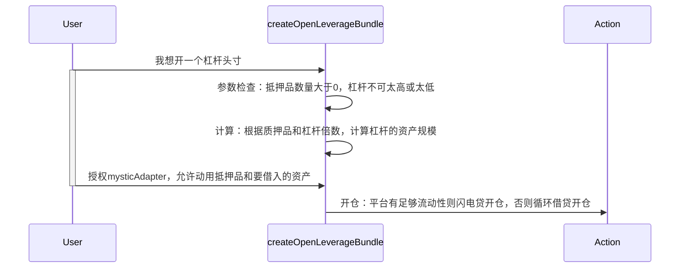
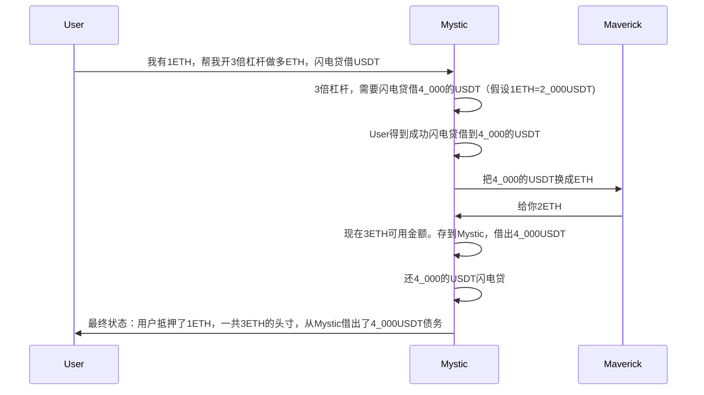
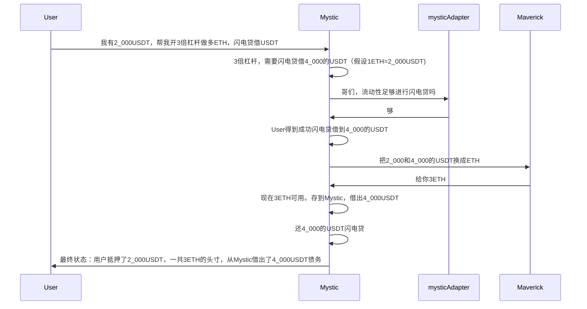
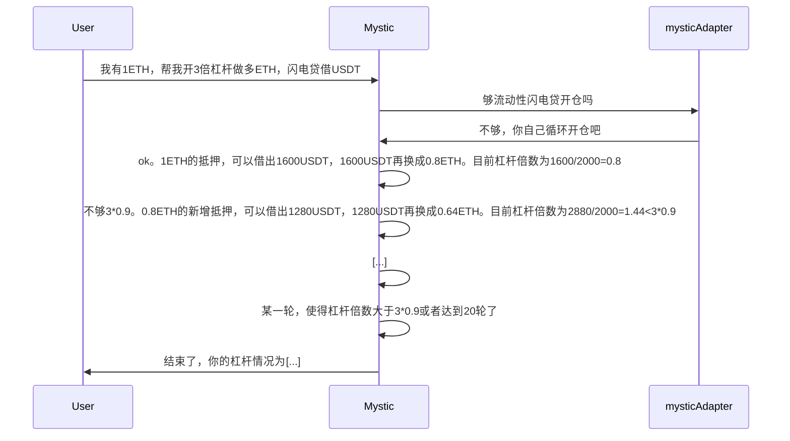
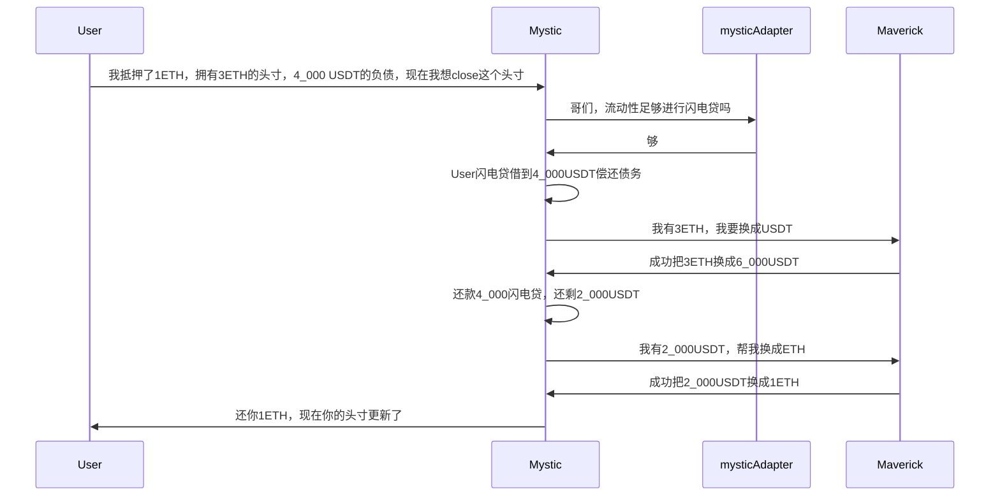

## 1.简介

来学习一下在智能合约中创建杠杆交易，通过学习[mystic在cantina的未结束的审计版本](https://github.com/cantina-competitions/mystic-monorepo/blob/42b70871d73c7acfd3b3f2b8ca19dee576be2123/bundler3/src/calls/MysticLeverageBundler.sol)，认识如何通过闪电贷或循环借贷的方式在 Mystic 平台上建立或关闭杠杆头寸，创建杠杆交易的调用序列（bundle）。

开始之前，我们先熟悉一下背景：什么是杠杆交易？简单来说，杠杆交易就是用少量的钱（叫做抵押品）去“借”更多的钱，来放大你的投资规模。比如：你有 1000 元，想买价值 2000 元 的东西。你可以用 2 倍杠杆，借 1000 元，这样总共就能控制 2000 元的资产。如果资产涨了，你赚的钱会变多；但如果跌了，你亏的也更多。

## 2.开仓杠杆

放大用户的初始抵押品来建立杠杆头寸。它会根据情况选择两种方式来实现：

- 闪电贷：如果Mystic平台上有足够的钱可以用，这种方式更快、更省手续费。
- 循环借贷：如果Mystic平台钱不够，就用这种方式，虽然慢一点，但也能凑够杠杆。

先来解释几个参数：

- asset: 要借入的资产，比如USDT
- collateralAsset: 你拿来当抵押品的资产，比如 ETH
- inputAsset: 你实际掏出来的资产，必须是上面两个之一（比如你给 USDT 或 ETH）
- initialCollateralAmount: 你掏出来的抵押品数量（比如 1000 个 USDT）
- targetLeverage: 你想要的杠杆倍数（比如 20000 表示 2 倍，因为这里 10000 = 1 倍）
- slippageTolerance: 滑点

> 为什么函数参数要分： asset, collateralAsset, inputAsset这三个参数呢?
>
> asset 是指你在杠杆交易中想要借入的资产。比如，你可能用 ETH 作为抵押品来借入 USDT，这里的 asset 就是 USDT
>
> collateralAsset 是你用来抵押的资产。在上面的例子中，ETH 就是 collateralAsset，因为你用它来换取借入 USDT 的资格。
>
> inputAsset 是你实际拿出来启动交易的资产。它可以是 collateralAsset，也可以是 asset，具体取决于你手头有什么。



```solidity
function createOpenLeverageBundle(address asset, address collateralAsset, address inputAsset, uint256 initialCollateralAmount, uint256 targetLeverage, uint256 slippageTolerance) external returns (Call[] memory bundle) {
  require(initialCollateralAmount > 0, "Zero collateral amount");
  require(targetLeverage > SLIPPAGE_SCALE, "Leverage must be > 1");
  require(targetLeverage <= 1000000, "Leverage too high");

  uint256 positionSize = initialCollateralAmount * targetLeverage / SLIPPAGE_SCALE;

  IERC20(collateralAsset).approve(address(mysticAdapter), type(uint256).max);
  IERC20(asset).approve(address(mysticAdapter), type(uint256).max);

  // Check if there's enough liquidity for flashloan
  if (mysticAdapter.getAvailableLiquidity(asset) > positionSize) {
      return _createOpenLeverageBundleWithFlashloan(asset, collateralAsset, inputAsset, initialCollateralAmount, targetLeverage, slippageTolerance);
  } else { // loop can still accomodate smaller leverages even with insufficient liqudiity in a pool, there will be a warning in the frontend though
      return _createOpenLeverageBundleWithLoops(asset, collateralAsset, inputAsset, initialCollateralAmount, targetLeverage, slippageTolerance);
  }
}
```

### 2.1.1闪电贷开仓原理

然后我们来讲闪电贷开仓。首先我们来看看：

1. 检查你实际掏出来的资产，必须是上面两个之一（asset或collateralAsset）
2. 滑点：如果没设置，则使用默认的3%
3. collateralValue抵押品价值，也就是initialCollateralAmount
4. 总头寸的大小positionSize：它根据抵押品的价值乘杠杆倍数得到（考虑了滑点）
5. 要借入的数量borrowAmount：比如你抵押了1000，开2倍杠杆，那么借入的数量就是2000-1000=1000
6. 创建交易对：用 asset 和 collateralAsset 生成一个标识（pairKey），方便平台追踪你的借贷和抵押。

```solidity
function _createOpenLeverageBundleWithFlashloan(address asset, address collateralAsset, address inputAsset, uint256 initialCollateralAmount, uint256 targetLeverage, uint256 slippageTolerance) internal returns (Call[] memory bundle) {
    require(inputAsset == collateralAsset || inputAsset == asset, "Input asset must be the same as collateral asset or asset");
    uint256 slippage = slippageTolerance == 0 ? DEFAULT_SLIPPAGE : slippageTolerance;
    uint256 collateralValue = initialCollateralAmount; //inputAsset == collateralAsset ? initialCollateralAmount : getQuote(inputAsset, collateralAsset, initialCollateralAmount);
    uint256 positionSize = collateralValue * targetLeverage / SLIPPAGE_SCALE;
    uint256 borrowAmount = positionSize - collateralValue;  //getQuote(collateralAsset, asset, positionSize - collateralValue);
    bytes32 pairKey = getPairKey(asset, collateralAsset);
		
		[...]
}
```

来看具体流程。它有两个bundle，你可以把它想象成合约会执行的操作。mainBundle包含2 个步骤，启动整个流程。flashloanCallbackBundle包含5 个步骤，处理借来的钱。

- 计算最终总共要借入的钱：原本要借入的钱+手续费+1（除法四舍五入截断，避免这个情况，加上1）
- 计算最终的抵押品数量totalCollateralAmount，后续例子中说明。

```solidity
    Call[] memory mainBundle = new Call[](2);
    Call[] memory flashloanCallbackBundle = new Call[](5);
    uint256 totalBorrowAmount = borrowAmount + mysticAdapter.flashLoanFee(borrowAmount) + 1; // +1 for rounding buffer
    uint256 totalCollateralAmount = 0;  // this is meant to force accuracy of collateral (and reduce discrepancy due to swap output)
    if (inputAsset == collateralAsset) {
        // When input is collateral: direct calculation, Calculate total collateral after leverage (initial + converted borrowed)
        totalCollateralAmount = collateralValue + getQuote(asset, collateralAsset, borrowAmount);
    } else {
        // When input is borrowing asset: calculate total borrowing first
        totalCollateralAmount = getQuote(asset, collateralAsset, positionSize);
    }
```

准备好数据之后，开始准备闪电贷bundle。假设我们要用资产A作为抵押，借入资产B，假设你提供了 1000 A，想用 2 倍杠杆，目标控制 2000 的头寸，需要借 1000 B。下面依次是5个bundle：

- 把从Mystic闪电贷借来的 B 转走：先转到swap平台（maverickAdapter），准备换成 A。
- 进行Swap：把B换成A
- 把换来的 A 转回去：从swap平台转到 Mystic 平台（mysticAdapter），准备存入。
- 存入A：把你原来的 1000 A（你提供的）加上换来的 1000 A，总共 2000 A，存进 Mystic 作为抵押品
- 借 B 还闪电贷：用 2000 A 作抵押，从 Mystic 借 1000 B（加上一点手续费，比如 1001 B），用来还闪电贷。

```solidity
    // Compressed callback bundle creation
    flashloanCallbackBundle[0] = _createERC20TransferCall(asset, address(maverickAdapter), type(uint256).max);
    flashloanCallbackBundle[1] = _createMaverickSwapCall(asset, collateralAsset, type(uint256).max, 0, slippage, false);
    flashloanCallbackBundle[2] = _createERC20TransferFromCall(collateralAsset, address(this), address(mysticAdapter), type(uint256).max);
    flashloanCallbackBundle[3] = _createMysticSupplyCall( collateralAsset, type(uint256).max, msg.sender);
    flashloanCallbackBundle[4] = _createMysticBorrowCall(asset, totalBorrowAmount, VARIABLE_RATE_MODE, msg.sender, address(mysticAdapter));
```

mainBundle[0]是借1000B，然后mainBundle[1]进行那5步操作。最后更新头寸情况。

```solidity
    // Compressed main bundle creation
    mainBundle[0] = inputAsset == collateralAsset ? _createERC20TransferFromCall(collateralAsset,msg.sender,address(this),initialCollateralAmount) : _createERC20TransferFromCall(asset,msg.sender,address(maverickAdapter),initialCollateralAmount);
    mainBundle[1] = _createMysticFlashloanCall(asset,borrowAmount,false,abi.encode(flashloanCallbackBundle));

    bundler.multicall(mainBundle);
    updatePositionTracking(pairKey, totalBorrowAmount, totalCollateralAmount, msg.sender, true);

    emit BundleCreated(msg.sender, keccak256("OPEN_LEVERAGE"), mainBundle.length);
    emit LeverageOpened(msg.sender, collateralAsset, asset, initialCollateralAmount, targetLeverage, totalCollaterals[pairKey], totalBorrows[pairKey]);

    return mainBundle;
```

### 2.1.2闪电贷开仓外围函数

- `updatePositionTracking()`：更新个人和全局的借款、抵押情况

### 2.1.3闪电贷开仓例子

看看整体流程图例子：

```solidity
asset：借入的资产（这里是USDT）。
collateralAsset：抵押资产（这里是ETH）。
inputAsset：用户输入的资产（这里是ETH）。
initialCollateralAmount：初始抵押金额（这里是1 ETH）。
targetLeverage：目标杠杆（这里是3倍，即 SLIPPAGE_SCALE * 3 = 30000）。

if (inputAsset == collateralAsset) { // 👈👈👈👈👈👈 对应这个分支
    // 本身输入的collateralValue数量ETH + 到交易所用借入borrowAmount数目的USDT换成ETH
    totalCollateralAmount = collateralValue + getQuote(asset, collateralAsset, borrowAmount);
} else {
    // When input is borrowing asset: calculate total borrowing first
    totalCollateralAmount = getQuote(asset, collateralAsset, positionSize);
}
```


另外一种情况：
```solidity
asset：借入的资产（这里是USDT）。
collateralAsset：抵押资产（这里是ETH）。
inputAsset：用户输入的资产（这里是USDT）。
initialCollateralAmount：初始抵押金额（这里是1 ETH）。
targetLeverage：目标杠杆（这里是3倍，即 SLIPPAGE_SCALE * 3 = 30000）。

if (inputAsset == collateralAsset) {
    // When input is collateral: direct calculation, Calculate total collateral after leverage (initial + converted borrowed)
    totalCollateralAmount = collateralValue + getQuote(asset, collateralAsset, borrowAmount);
} else { // 👈👈👈👈👈👈 对应这个分支
    // 本身输入用来抵押的资产 和 借入的资产一样，都是USDT，那么直接把他们都换成ETH
    totalCollateralAmount = getQuote(asset, collateralAsset, positionSize);
}
```



上面2个例子，用户做多ETH。用户抵押的价值是2000$，借了4000$的债务（手动平仓的时候需要固定还4000USDT）：

- 如果未来ETH暴涨到4000$，那么3*4000=12,000$，还4000USDT的债务，盈利12000-2000-4000=6000$。

- 如果未来ETH下跌，只要3个ETH的总价值下跌即将到达2000$的抵押量（比如1500$是阈值），那么就可以清算，否则会产生坏账。比如：
  - 初始贷款价值比（LTV） = 债务 / 抵押价值 = 4,000 / (3 ETH * 2,000) = 4,000 / 6,000 = 66.67%。【或者换个说法：抵押率。6000/4000=150%】
  - 现在贷款价值比（LTV） = 债务 / 抵押价值 = 4,000 / (3 ETH * 1,500) = 4,000 / 4,500 = 88.9%。假设88%就可以清算。【或者换个说法：抵押率。4500/4000=112.5%。】
  - 1500~2000之间这个缓冲值是风险区间，由项目方自行决定。此时系统清算：把3个ETH换成4500USDT，偿还4000$的债务，剩下500$扣除清算奖励和手续费之后，再还给用户。也就是说，用户在ETH下跌的时候，本金从2000变成了不到500。

### 2.2.1.循环开仓原理

该函数在无法通过单次闪贷完成杠杆操作时（如底层池流动性不足），通过多次循环操作逐步构建杠杆头寸。其核心逻辑是：循环借款 → 兑换为抵押资产 → 重复抵押 → 再次借款，通过迭代放大用户的抵押仓位。

函数的开始：检查参数、初始化一些变量

```solidity
function _createOpenLeverageBundleWithLoops(address asset, address collateralAsset, address inputAsset,  uint256 initialCollateralAmount, uint256 targetLeverage, uint256 slippageTolerance) internal returns (Call[] memory bundle) {
    // 非常耗费gas，限制在25次循环（4倍杠杆），并且极其无效，只有在池无法完成闪电贷时才使用
    // 我们理解迭代不等于杠杆，但为了限制gas，我们假设迭代==循环，而不是1-ltv**(n+1)/1-ltv，其中n是迭代
    require(inputAsset == collateralAsset, "Input asset must be the same as collateral asset");
    uint256 slippage = slippageTolerance == 0 ? DEFAULT_SLIPPAGE : slippageTolerance;
    uint256 ltv = mysticAdapter.getAssetLtv(collateralAsset);
    uint8 loop = 20;
    bytes32 pairKey = getPairKey(asset, collateralAsset);
    require(ltv > 0, "Collateral asset has no LTV");
		[...]
}
```

mainBundle[0]: 将用户的初始抵押资产从用户地址转移到 mysticAdapter。mainBundle[1]: 调用 mysticAdapter 的 mysticSupply 函数，将初始抵押资产存入协议。然后更新抵押情况。

```solidity
    Call[] memory mainBundle = new Call[](2+ loop*4);
    mainBundle[0] = _createERC20TransferFromCall(inputAsset,msg.sender,address(mysticAdapter),initialCollateralAmount);
    mainBundle[1] = _createMysticSupplyCall( collateralAsset, type(uint256).max, msg.sender);
    uint256 newCollateral = initialCollateralAmount;
    totalCollaterals[pairKey] += newCollateral;
    totalCollateralsPerUser[pairKey][msg.sender] += newCollateral;
```

通过 for 循环（最多 20 次）执行以下步骤（假设质押质押ETH，借USDT，做多ETH）：

- 借入资产：调用 _createMysticBorrowCall，从协议借入最大可能数量的 asset（借入金额受 LTV 限制）。【借USDT）
- 资产交换：调用 _createMaverickSwapCall，将借入的 asset 兑换为 collateralAsset。【将USDT转化为ETH）
- 转移抵押资产：调用 _createERC20TransferFromCall，将兑换得到的 collateralAsset 转移到 mysticAdapter。【将ETH转移到mysticAdapter】
- 存入抵押资产：调用 _createMysticSupplyCall，将新的 collateralAsset 存入协议，增加抵押。【将ETH存入Mystic】

每次循环都更新状态：新的抵押数量，新的借款数量。然后检查当前杠杆倍数是否接近目标杠杆（允许 10% 误差，即 leverage >= targetLeverage * 0.9），若满足则提前退出循环。

```solidity
    for (uint8 i=0; i< loop; i++){
      uint256 idx = 2 + i * 4;
      mainBundle[idx] = _createMysticBorrowCall(asset, type(uint256).max, VARIABLE_RATE_MODE, msg.sender, address(maverickAdapter));
      mainBundle[idx+1] = _createMaverickSwapCall(asset, collateralAsset, type(uint256).max, 0, slippage, false);
      mainBundle[idx+2] = _createERC20TransferFromCall(collateralAsset, address(this), address(mysticAdapter), type(uint256).max);
      mainBundle[idx+3] = _createMysticSupplyCall( collateralAsset, type(uint256).max, msg.sender);

      newCollateral = newCollateral * ltv / SLIPPAGE_SCALE;
      uint256 newBorrow = getQuote(collateralAsset, asset, newCollateral) * ltv / SLIPPAGE_SCALE;
      updatePositionTracking(pairKey, newBorrow, newCollateral, msg.sender, true);

      uint leverage = (totalCollateralsPerUser[pairKey][msg.sender]) * SLIPPAGE_SCALE / (totalCollateralsPerUser[pairKey][msg.sender] - totalBorrowsPerUser[pairKey][msg.sender]);
      if (leverage >= (targetLeverage * 9000) / SLIPPAGE_SCALE) break; // break if leverage gotten is in similar range as expected 10% error margin 4 -> 3.6 is fine
    }
```

最后验证杠杆是否安全（借入金额小于抵押金额），然后执行。

```solidity
    require(totalBorrowsPerUser[pairKey][msg.sender] < totalCollateralsPerUser[pairKey][msg.sender], "Leverage too high");

    bundler.multicall(mainBundle);

    emit BundleCreated(msg.sender, keccak256("OPEN_LEVERAGE"), mainBundle.length);
    emit LeverageOpened(msg.sender, collateralAsset, asset, initialCollateralAmount, targetLeverage, totalCollaterals[pairKey], totalBorrows[pairKey]);
    return mainBundle;
```

### 2.2.2.循环开仓例子

- 假设：抵押资产是 ETH，借入资产是 USDT，目标是 3 倍做多 ETH，当前价格 1 ETH = 2000 USDT。我们假设 LTV（贷款价值比）为 80%（即 0.8）
- 杠杆目标：
  - 初始抵押：1 ETH，价值 2000 USDT。
  - 3 倍杠杆意味着总头寸价值为：3*2000= 6000 USDT。相当于总抵押的ETH为3个。因此需要借入6000-2000=4000USDT。
  - 最终状态：用户抵押1ETH，3个ETH的债务，借4000USDT。在本处，大于杠杆倍数的90%就停止。

|           | 累计抵押（资产）                            | 新增借出           | 累计借出（负债）                                     | 杠杆倍数             | 本轮负债可换抵押资产        |
| --------- | ------------------------------------------- | ------------------ | ---------------------------------------------------- | -------------------- | --------------------------- |
| 第1次借贷 | 1ETH                                        | 2000*0.8=1600u     | 1600u                                                | 1600/2000=0.8        | 1600u=0.8ETH                |
| 第2次借贷 | 1+0.8=1.8ETH                                | 1600*0.8=1280u     | 1600+1280=2,880                                      | 2880/2000=1.44       | 1280u=0.64ETH               |
| 第3次借贷 | 1+0.8+0.64=2.44 ETH                         | 1280*0.8=1,024     | 1600+1280+1024=3,904                                 | 3904/2000=1.952      | 1024u=0.512ETH              |
| 第4次借贷 | 1+0.8+0.64+0.512=2.952 ETH                  | 1024*0.8=819.2     | 1600+1280+1024+819.2=4,723.2                         | 4,723.2/2000=2.362   | 819.2u=0.4096ETH            |
| 第5次借贷 | 1+0.8+0.64+0.512+0.4096=3.362               | 819.2*0.8=655.36   | 1600+1280+1024+819.2+655.36=5,378.56                 | 5,378.56 /2000=2.689 | 655.36u=0.3277ETH           |
| 第6次借贷 | 1+0.8+0.64+0.512+0.4096+0.3277=3.689        | 655.36*0.8=524.288 | 1600+1280+1024+819.2+655.36+524.288=5,902.848        | 5,902.848/2000=2.951 | 大于目标杠杆倍数3*0.9，结束 |

用图来表示：



## 3.关仓杠杆

### 3.1.1闪电贷关仓原理

首先获取到key，然后计算debtToClose：如果传入的是uint256.max或者输入的debtToClose过大，那么都是调整为目前所持有的借款数量。

```solidity
function createCloseLeverageBundle(address asset, address collateralAsset, uint256 debtToClose) external returns (Call[] memory bundle) {
  bytes32 pairKey = getPairKey(asset, collateralAsset);
  if(debtToClose == type(uint256).max || totalBorrowsPerUser[pairKey][msg.sender] <= debtToClose) {
    debtToClose = totalBorrowsPerUser[pairKey][msg.sender];
  }

  require(debtToClose > 0, "no debt found");

  // Check if there's enough liquidity for flashloan or if we're closing a small position
  if (mysticAdapter.getAvailableLiquidity(asset) > debtToClose) {
    return _createCloseLeverageBundleWithFlashloan(asset, collateralAsset, debtToClose);
  } else {
    return _createCloseLeverageBundleWithLoops(asset, collateralAsset, debtToClose);
  }
}
```

然后我们来看看用闪电贷来关仓。首先计算一系列需要用到的值，比如debtToCover、collateralForRepayment等

```solidity
function _createCloseLeverageBundleWithFlashloan(address asset, address collateralAsset, uint256 debtToClose) internal returns (Call[] memory bundle) {
    Call[] memory mainBundle = new Call[](5);
    Call[] memory flashloanCallbackBundle = new Call[](4);
    bytes32 pairKey = getPairKey(asset, collateralAsset);
    uint256 debtToCover = debtToClose;
    uint256 totalBorrowAmount = debtToCover + mysticAdapter.flashLoanFee(debtToCover) + 1; // +1 for rounding buffer, plus new fee
    uint256 collateralForRepayment = (totalCollateralsPerUser[pairKey][msg.sender] * debtToClose) / totalBorrowsPerUser[pairKey][msg.sender];
    collateralForRepayment = collateralForRepayment > totalCollateralsPerUser[pairKey][msg.sender]? totalCollateralsPerUser[pairKey][msg.sender]: collateralForRepayment; //safeguard to avoid overflow
}
```

flashloanCallbackBundle包含闪电贷回调中的操作，顺序执行以下步骤：

- [0]：偿还指定金额的债务
- [1]：从 mysticAdapter（此项目） 提取 collateralForRepayment 数量的抵押品，发送到 maverickAdapter（swap平台）。
- [2]：在maverickAdapter平台进行swap换成asset代币
- [3]：将swap得到的asset代币转到mysticAdapter

```solidity
     // Compressed callback bundle creation
    flashloanCallbackBundle[0] = _createMysticRepayCall(asset, debtToCover, VARIABLE_RATE_MODE, msg.sender);
    flashloanCallbackBundle[1] = _createMysticWithdrawCall(collateralAsset, collateralForRepayment, msg.sender, address(maverickAdapter));
    flashloanCallbackBundle[2] = _createMaverickSwapCall(collateralAsset, asset, collateralForRepayment, totalBorrowAmount , 0, false);
    flashloanCallbackBundle[3] = _createERC20TransferFromCall(asset, address(this), address(mysticAdapter), type(uint256).max);
```

flashloanCallbackBundle包含如下步骤：

- [0]：借入 debtToCover 数量的 asset，并指定 flashloanCallbackBundle 作为回调。
- [1]：将asset转移到 maverickAdapter，准备后续swap。
- [2]：将剩余的 asset 换成 collateralAsset，
- [3]：将换得的 collateralAsset 转移到当前合约。
- [4]：将 collateralAsset 从合约转移给用户。

```solidity
    // Compressed main bundle creation
    mainBundle[0] = _createMysticFlashloanCall(asset,debtToCover,false, abi.encode(flashloanCallbackBundle));
    mainBundle[1] = _createERC20TransferCall(asset, address(maverickAdapter), type(uint256).max);
    mainBundle[2] = _createMaverickSwapCall(asset, collateralAsset, type(uint256).max, 0 , 0, false);
    mainBundle[3] = _createERC20TransferCall(collateralAsset, address(this), type(uint256).max);
    mainBundle[4] = _createERC20TransferFromCall(collateralAsset, address(this), msg.sender, type(uint256).max);
```

执行调用，更新头寸

```solidity
    bundler.multicall(mainBundle);
    updatePositionTracking(pairKey, debtToCover, collateralForRepayment, msg.sender, false);

    emit BundleCreated(msg.sender, keccak256("CLOSE_LEVERAGE"), mainBundle.length);
    emit LeverageClosed(msg.sender, collateralAsset, asset, collateralForRepayment, totalCollaterals[pairKey], totalBorrows[pairKey]);

    return mainBundle;
```

### 3.1.2闪电贷关仓例子

用图来说明整个流程：



> 另外说明一下，这是做多的行为，然后现在关仓。如果ETH涨，做多成功，那么3ETH比如可能去到价值1_000_000USDT，那么还固定的4_000UST负债，那么爆赚。

### 3.2.1循环关仓原理

和之前一样，先准备好一些要用到的参数

```solidity
function _createCloseLeverageBundleWithLoops(address asset, address collateralAsset, uint256 debtToClose) internal returns (Call[] memory bundle) {
  bytes32 pairKey = getPairKey(asset, collateralAsset);
  uint256 collateralToWithdraw = (totalCollateralsPerUser[pairKey][msg.sender] * debtToClose) / totalBorrowsPerUser[pairKey][msg.sender];
  uint256 leverage = (totalCollateralsPerUser[pairKey][msg.sender]) / (totalCollateralsPerUser[pairKey][msg.sender] - totalBorrowsPerUser[pairKey][msg.sender]);
  uint256 ltv = mysticAdapter.getAssetLtv(collateralAsset);
  uint8 numLoops = 20;
  uint256 remainingDebt = debtToClose;
  uint256 borrowable = mysticAdapter.getWithdrawableLiquidity(msg.sender, collateralAsset);
  Call[] memory mainBundle = new Call[](numLoops * 4+1); 
}
```

然后mainBundle有如下步骤：

- [0]：从 mysticAdapter（此平台） 提取最大数量的抵押品头寸，发送到 maverickAdapter（swap平台）。
- [1]：通过 maverickAdapter（swap平台） 将提取的抵押品 (collateralAsset) 换成借入资产 (asset)
- [2]：将换得的asset从当前合约转移到 mysticAdapter（此平台）。
- [3]：调用 mysticAdapter.mysticRepay 将asset还给用户

```solidity
  // For each loop iteration
  for (uint8 i = 0; i < numLoops; i++) {
      uint256 baseIndex = i * 4;
      mainBundle[baseIndex + 0] = _createMysticWithdrawCall(collateralAsset, type(uint256).max, msg.sender, address(maverickAdapter));
      mainBundle[baseIndex + 1] = _createMaverickSwapCall(collateralAsset, asset, type(uint256).max, 0, 0, false);
      mainBundle[baseIndex + 2] = _createERC20TransferFromCall(asset, address(this), address(mysticAdapter), type(uint256).max);
      mainBundle[baseIndex + 3] = _createMysticRepayCall(asset, type(uint256).max, VARIABLE_RATE_MODE, msg.sender);

      remainingDebt = remainingDebt > borrowable? remainingDebt - borrowable:0;
      borrowable = borrowable * SLIPPAGE_SCALE/ ltv;
      if(remainingDebt == 0) break;
  }
```

最后执行并更新债务

```solidity
  mainBundle[numLoops * 4] = _createMysticWithdrawCall(collateralAsset, type(uint256).max, msg.sender, msg.sender);
  uint spentCollateral = getQuote(asset, collateralAsset, debtToClose - remainingDebt);
  bundler.multicall(mainBundle);
  updatePositionTracking(pairKey, debtToClose - remainingDebt, spentCollateral, msg.sender, false);

  emit BundleCreated(msg.sender, keccak256("CLOSE_LEVERAGE_LOOPS"), mainBundle.length);
  emit LeverageClosed(msg.sender, collateralAsset, asset, collateralToWithdraw, totalCollaterals[pairKey], totalBorrows[pairKey]);

  return mainBundle;
```

### 3.2.2循环关仓例子

用户拥有 3 ETH 的借款头寸，抵押了 2000 USDT，当前价格 1 ETH = 2000 USDT，表示 3 倍做多。

|           | 累计抵押（资产） | 新增提取        | 提取等价asset  | remainingDebt     |
| --------- | ---------------- | --------------- | -------------- | ----------------- |
| 第1次借贷 | 2000u            | 2000*0.8=1600u  | 1600u=0.8ETH   | 4000-1600=2400u   |
| 第2次借贷 | 1600u            | 1600*0.8=1,280u | 1280u=0.64ETH  | 2400-1280=1,120 u |
| 第2次借贷 | 1280u            | 1280*0.8=1,024u | 1024u=0.512ETH | 1120-1024<0，结束 |

最后累计0.8+0.64+0.512=1.952 ETH，全部给用户。并且将ETH换成对应的USDT，更新债务。

## 4.更新杠杆

调整你已经开好的杠杆头寸，并且只能用闪电贷的方式，不可以用循环借贷的方式。

首先一些检查和准备一些要用到的数据：

```solidity
function updateLeverageBundle(
    address asset,
    address collateralAsset,
    uint256 newTargetLeverage,
    uint256 slippageTolerance
) external returns (Call[] memory bundle) {
    require(newTargetLeverage > SLIPPAGE_SCALE, "Leverage must be > 1");
    require(newTargetLeverage <= 1000000, "Leverage too high"); // Max 100x
    bytes32 pairKey = getPairKey(asset, collateralAsset);
    uint256 slippage = slippageTolerance == 0 ? DEFAULT_SLIPPAGE : slippageTolerance;
    uint256 currentCollateral = totalCollateralsPerUser[pairKey][msg.sender]; // 当前的抵押
    uint256 currentBorrow = totalBorrowsPerUser[pairKey][msg.sender]; // 当前的借款

    require(currentCollateral > 0 && currentBorrow > 0, "No existing position");
    // 当前的杠杆倍数
    uint256 currentLeverage = (currentCollateral * SLIPPAGE_SCALE) / (currentCollateral - currentBorrow);
    // 计算新的借款数量
    uint256 newBorow =  currentBorrow * (newTargetLeverage - SLIPPAGE_SCALE) * currentLeverage / (newTargetLeverage * (currentLeverage - SLIPPAGE_SCALE)); //getQuote(collateralAsset, asset, currentCollateral * (newTargetLeverage - SLIPPAGE_SCALE) / newTargetLeverage);
    // 计算新借款与旧借款的diff
    int256 borrowDelta = int256(newBorow) - int256(currentBorrow);
}
```

如果borrowDelta > 0，那么是增加杠杆倍数。计算需要额外借款的数量additionalBorrowAmount、总借款的数量totalBorrowAmount。然后开始五部曲更新债务：

- [0]：闪电贷从maverickAdapter借款
- [1]：在Maverick平台，将借款的asset换成抵押品collateralAsset
- [2]：将换到的collateralAsset发送回mysticAdapter
- [3]：将换到的collateralAsset存给用户
- [4]：用户用新的抵押量借出asset，然后还款闪电贷

```solidity
    // Create appropriate bundles based on the operation type
    Call[] memory mainBundle;
    Call[] memory flashloanCallbackBundle;

    if (borrowDelta > 0) {
        // INCREASE LEVERAGE CASE
      uint256 additionalBorrowAmount = uint256(borrowDelta);
      uint totalBorrowAmount = additionalBorrowAmount + mysticAdapter.flashLoanFee(additionalBorrowAmount) + 1;

      mainBundle = new Call[](1);
      flashloanCallbackBundle = new Call[](5);
      flashloanCallbackBundle[0] = _createERC20TransferCall(asset, address(maverickAdapter), type(uint256).max);
      flashloanCallbackBundle[1] = _createMaverickSwapCall(asset, collateralAsset, type(uint256).max, 0, slippage, false);
      flashloanCallbackBundle[2] = _createERC20TransferFromCall(collateralAsset, address(this), address(mysticAdapter), type(uint256).max);
      flashloanCallbackBundle[3] = _createMysticSupplyCall( collateralAsset, type(uint256).max, msg.sender);
      flashloanCallbackBundle[4] = _createMysticBorrowCall(asset, totalBorrowAmount, VARIABLE_RATE_MODE, msg.sender, address(mysticAdapter));

      mainBundle[0] = _createMysticFlashloanCall(asset,additionalBorrowAmount,false,abi.encode(flashloanCallbackBundle));
      updatePositionTracking(pairKey, additionalBorrowAmount, 0, msg.sender, true);
```

如果是降低杠杆，跟之前关仓类似：

- [0]：偿还指定金额的债务
- [1]：从 mysticAdapter（此项目） 提取 collateralForRepayment 数量的抵押品，发送到 maverickAdapter（swap平台）。
- [2]：在maverickAdapter平台进行swap换成asset代币
- [3]：将swap得到的asset代币转到mysticAdapter

```solidity
    } else if (borrowDelta < 0) {
      uint256 repayAmount = uint256(-borrowDelta);
      uint256 collateralForRepayment = (totalCollateralsPerUser[pairKey][msg.sender] * repayAmount) / totalBorrowsPerUser[pairKey][msg.sender];

      mainBundle = new Call[](5);
      flashloanCallbackBundle = new Call[](4);

      flashloanCallbackBundle[0] = _createMysticRepayCall(asset, repayAmount, VARIABLE_RATE_MODE, msg.sender);
      flashloanCallbackBundle[1] = _createMysticWithdrawCall(collateralAsset, collateralForRepayment, msg.sender, address(maverickAdapter));
      flashloanCallbackBundle[2] = _createMaverickSwapCall(collateralAsset, asset, collateralForRepayment, repayAmount , 0, false);
      flashloanCallbackBundle[3] = _createERC20TransferFromCall(asset, address(this), address(mysticAdapter), type(uint256).max);
      // Compressed main bundle creation
      mainBundle[0] = _createMysticFlashloanCall(asset,repayAmount,false, abi.encode(flashloanCallbackBundle));
      mainBundle[1] = _createERC20TransferCall(asset,address(maverickAdapter), type(uint256).max);
      mainBundle[2] = _createMaverickSwapCall(asset, collateralAsset, type(uint256).max, 0 , 0, false);
      mainBundle[3] = _createERC20TransferCall(collateralAsset,address(this), type(uint256).max);
      mainBundle[4] = _createERC20TransferFromCall(collateralAsset, address(this), msg.sender, type(uint256).max);
      updatePositionTracking(pairKey, repayAmount, 0, msg.sender, false);
    } else {
        revert("No changes to position");
    }

    bundler.multicall(mainBundle);

    emit BundleCreated(msg.sender, keccak256("UPDATE_LEVERAGE"), mainBundle.length);
    emit LeverageUpdated(msg.sender, collateralAsset, asset, currentCollateral, currentLeverage, newTargetLeverage, totalCollaterals[pairKey], totalBorrows[pairKey]);

    return mainBundle;
```

