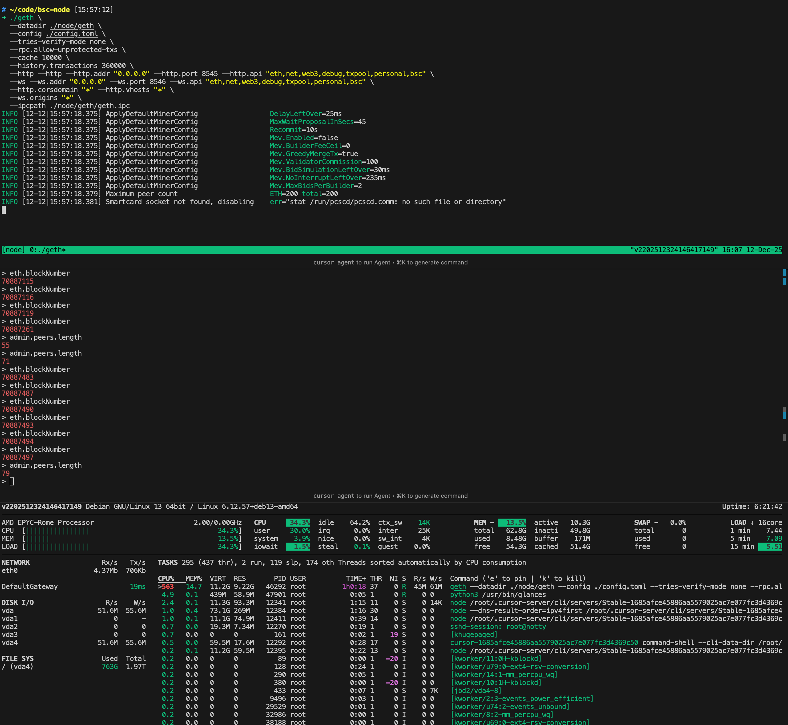

## 运行一个BSC Fast Node

### 1. 服务器

（1）准备好一个服务器，最新的要求可以看[文档](https://docs.bnbchain.org/bnb-smart-chain/developers/node_operators/node_best_practices/#fast-node-recommended-configuration)。目前的要求是：

```bash
Processor: Minimum 16-core CPU.
Memory: At least 32 GB RAM.
Storage: Solid State Drive (SSD) with a minimum capacity of 2TB.
Network: Stable and high-speed internet connection, minimum 5 MBps.
```

然后去买一个服务器，最好是Ubuntu

### 2. 准备工作

在云服务器上下载好这些常用工具：

- git
- tmux

下载运行节点时候需要用到的工具

```bash
sudo apt install -yfqq aria2 zstd pv openssl tar unzip tree glances
```

### 3. 下载geth二进制文件

下载geth

```bash
wget   $(curl -s https://api.github.com/repos/bnb-chain/bsc/releases/latest |grep browser_ |grep geth_linux |cut -d\" -f4)
```

改名

```bash
mv geth_linux geth
```

给权限

```bash
chmod -v u+x geth
```

### 4. 下载geth config文件

下载

```bash
wget   $(curl -s https://api.github.com/repos/bnb-chain/bsc/releases/latest |grep browser_ |grep mainnet |cut -d\" -f4)
```

解压

```bash
unzip mainnet.zip
```

### 5. 下载快照

我下载BNB48 Club的[快照](https://github.com/48Club/bsc-snapshots)。这个过程比较耗时

> 要使用最新的快照

```bash
# aria2c -s4 -x4 -k1024M -o snapshot.tar.zst $SNAPSHOT_URL
aria2c -s4 -x4 -k1024M -o snapshot.tar.zst https://complete.snapshots.48.club/geth.fast.70885094.tar.zst
```

执行：

```bash
pv snapshot.tar.zst | openssl md5
```

提取快照，这个过程比较耗时：

```bash
pv snapshot.tar.1.zst | tar --use-compress-program="zstd -d --long=31" -xf - -C node
```

### 6. 修剪 Trie 数据

移除不必要的 trie 数据，让节点变成 fast mode（不可逆，转 full node 需要重下快照）：

```bash
./geth snapshot prune-state --datadir ./node/geth/chaindata ./genesis.json
```

这个过程比较耗时。

### 7. 启动节点

启动节点同步完剩余的区块：

```bash
./geth \
  --datadir ./node/geth \
  --config ./config.toml \
  --tries-verify-mode none \
  --rpc.allow-unprotected-txs \
  --cache 10000 \
  --history.transactions 360000 \
  --http --http --http.addr "0.0.0.0" --http.port 8545 --http.api "eth,net,web3,debug,txpool,personal,bsc" \
  --ws --ws.addr "0.0.0.0" --ws.port 8546 --ws.api "eth,net,web3,debug,txpool,personal,bsc" \
  --http.corsdomain "*" --http.vhosts "*" \
  --ws.origins "*" \
  --ipcpath ./node/geth/geth.ipc
```

进入控制台

```
# ~/code/bsc-node [15:46:31]
➜ tree -L 3
.
├── config.toml
├── genesis.json
├── geth
└── node
    └── geth
        ├── blobpool
        ├── bsc.log -> /root/code/bsc-node/node/geth/bsc.log.2025-12-12_15
        ├── bsc.log.2025-12-12_15
        ├── chaindata
        ├── geth
        ├── geth.ipc
        └── keystore

7 directories, 6 files

# ~/code/bsc-node [15:47:35]
➜ ./geth attach ./node/geth/geth.ipc
Welcome to the Geth JavaScript console!

instance: Geth/v1.6.4-0f7131f0-20251204/linux-amd64/go1.24.10
at block: 70885746 (Mon Dec 08 2025 04:53:28 GMT+0100 (CET))
 datadir: /root/code/bsc-node/node/geth
 modules: admin:1.0 debug:1.0 eth:1.0 mev:1.0 miner:1.0 net:1.0 parlia:1.0 rpc:1.0 txpool:1.0 web3:1.0

To exit, press ctrl-d or type exit
> eth.syncing
```

常用的命令：

```bash
// 1. 最常用：看当前区块高度和同步状态
eth.syncing

// 如果返回 false，说明已经同步完成
// 如果返回一个对象，大概长这样，说明还在同步：
// {
//   currentBlock: 35481234,
//   highestBlock: 45481234,
//   startingBlock: 0,
//   ...
// }

// 2. 当前节点最新区块高度
eth.blockNumber

// 3. 看看对等节点数量
net.peerCount

// 4. 退出 console
exit
```

### 8. 最终效果

连接节点控制台：

```
➜ ./geth attach ./node/geth/geth.ipc
Welcome to the Geth JavaScript console!

instance: Geth/v1.6.4-0f7131f0-20251204/linux-amd64/go1.24.10
at block: 70886895 (Mon Dec 08 2025 05:07:49 GMT+0100 (CET))
 datadir: /root/code/bsc-node/node/geth
 modules: admin:1.0 debug:1.0 eth:1.0 mev:1.0 miner:1.0 net:1.0 parlia:1.0 rpc:1.0 txpool:1.0 web3:1.0

To exit, press ctrl-d or type exit
> eth.syncing
false
> eth.blockNumber
70886895
> eth.blockNumber
70886895
> net.peerCount
6
> net.peerCount
14
> eth.blockNumber
70886895
> admin.peers.length
28
> eth.blockNumber
70886968
> eth.blockNumber
70887011
> admin.peers.length
30
> admin.peers.length
36
> admin.peers.length
42
> eth.blockNumber
70887080
> eth.blockNumber
70887116
> eth.blockNumber
70887119
> eth.blockNumber
70887261
> admin.peers.length
55
> admin.peers.length
71
> eth.blockNumber
70887483
> eth.blockNumber
70887494
> eth.blockNumber
70887497
> admin.peers.length
79
> 
```
节点正在运行：
```bash
# ~/code/bsc-node [15:57:12]
➜ ./geth \
  --datadir ./node/geth \
  --config ./config.toml \
  --tries-verify-mode none \
  --rpc.allow-unprotected-txs \
  --cache 10000 \
  --history.transactions 360000 \
  --http --http --http.addr "0.0.0.0" --http.port 8545 --http.api "eth,net,web3,debug,txpool,personal,bsc" \
  --ws --ws.addr "0.0.0.0" --ws.port 8546 --ws.api "eth,net,web3,debug,txpool,personal,bsc" \
  --http.corsdomain "*" --http.vhosts "*" \
  --ws.origins "*" \
  --ipcpath ./node/geth/geth.ipc
INFO [12-12|15:57:18.375] ApplyDefaultMinerConfig                  DelayLeftOver=25ms
INFO [12-12|15:57:18.375] ApplyDefaultMinerConfig                  MaxWaitProposalInSecs=45
INFO [12-12|15:57:18.375] ApplyDefaultMinerConfig                  Recommit=10s
INFO [12-12|15:57:18.375] ApplyDefaultMinerConfig                  Mev.Enabled=false
INFO [12-12|15:57:18.375] ApplyDefaultMinerConfig                  Mev.BuilderFeeCeil=0
INFO [12-12|15:57:18.375] ApplyDefaultMinerConfig                  Mev.GreedyMergeTx=true
INFO [12-12|15:57:18.375] ApplyDefaultMinerConfig                  Mev.ValidatorCommission=100
INFO [12-12|15:57:18.375] ApplyDefaultMinerConfig                  Mev.BidSimulationLeftOver=30ms
INFO [12-12|15:57:18.375] ApplyDefaultMinerConfig                  Mev.NoInterruptLeftOver=235ms
INFO [12-12|15:57:18.375] ApplyDefaultMinerConfig                  Mev.MaxBidsPerBuilder=2
INFO [12-12|15:57:18.379] Maximum peer count                       ETH=200 total=200
INFO [12-12|15:57:18.381] Smartcard socket not found, disabling    err="stat /run/pcscd/pcscd.comm: no such file or directory"
```




