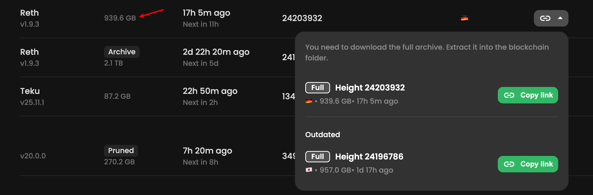

## 执行客户端

reth: https://reth.rs/run/ethereum#running-without-a-consensus-layer

```bash
reth node \
  --full \
  --chain mainnet \
  --datadir /root/code/node/eth/data \
  --http \
  --http.addr 0.0.0.0 \
  --http.port 7001 \
  --http.api "eth,net,web3,txpool,debug,trace" \
  --http.corsdomain "*" \
  --authrpc.jwtsecret /secrets/jwt.hex \
  --authrpc.addr 127.0.0.1 \
  --authrpc.port 8551 \
  --ws \
  --ws.addr 0.0.0.0 \
  --ws.port 7002 \
  --ws.api "eth,net,web3,txpool,debug,trace" \
  --ws.origins "*" \
  --ipcpath /root/code/node/eth/data/reth.ipc
```

## 共识客户端

lighthouse: https://lighthouse-book.sigmaprime.io/run_a_node.html

```bash
lighthouse bn \
  --network mainnet \
  --execution-endpoint http://localhost:8551 \
  --execution-jwt /secrets/jwt.hex \
  --checkpoint-sync-url https://mainnet.checkpoint.sigp.io \
  --purge-db \
  --disable-backfill-rate-limiting
```

用了上述参数，磁盘占用**不会随时间显著增大**，也就几十G

解释一下参数：

| 参数                                                       | 作用                                                         |
| ---------------------------------------------------------- | ------------------------------------------------------------ |
| `lighthouse bn`                                            | 启动 **Beacon Node**（共识层节点），不跑验证者客户端。       |
| `--network mainnet`                                        | 告诉 Lighthouse 连接 以太坊主网。                            |
| `--execution-endpoint http://localhost:8551`               | 指定 **执行层（reth/geth/…）的 Engine-API** 地址与端口，用于接收 payload 与 fork-choice 消息。 |
| `--execution-jwt /secrets/jwt.hex`                         | 与执行层通信所需的 **JWT 密钥文件**；两边必须完全一致，否则引擎调用会被拒（InvalidToken）。 |
| `--checkpoint-sync-url https://mainnet.checkpoint.sigp.io` | **轻量快速同步**：从 Sigma Prime 提供的公开检查点节点一次性拉取最新 finalized 状态，跳过从创世开始的漫长下载。 |
| `--purge-db`                                               | **首次启动时强制以“修剪模式”建库**，不保留历史状态，数据库体积保持最小（≈ 20–30 GB）。 |
| `--disable-backfill-rate-limiting`                         | 关闭回填空区块时的速率限制，让节点在后台更快地补齐旧区块，缩短同步时间。 |

## 输出

output: okay我们现在正在同步中


## 使用快照

这样太慢了，如果自己同步，估计要一周时间。我们使用快照，这里选择merkle的快照：https://www.merkle.io/snapshots

这是我的流程：

```
# ~/code/node/eth [5:01:57]
➜ ll             
total 12K
drwxr-xr-x  7 root root 4.0K Jan 11 05:01 data
drwxr-xr-x 22 root root 4.0K Jan 10 14:25 lighthouse
drwxr-xr-x 16 root root 4.0K Jan 10 13:59 reth

# ~/code/node/eth [5:01:59]
➜ cd data 

# ~/code/node/eth/data [5:02:02]
➜ ll
total 2.4M
drwxr-xr-x 2 root root 4.0K Jan 10 14:42 blobstore
drwxr-xr-x 2 root root 4.0K Jan 10 14:12 db
-rw-r--r-- 1 root root   64 Jan 10 14:12 discovery-secret
drwxr-xr-x 2 root root 4.0K Jan 10 15:18 etl-tmp
drwxr-xr-x 3 root root 4.0K Jan 10 14:12 invalid_block_hooks
-rw-r--r-- 1 root root   64 Jan 10 14:12 jwt.hex
-rw-r--r-- 1 root root 2.3M Jan 11 05:01 known-peers.json
-rw-r--r-- 1 root root 2.3K Jan 10 14:12 reth.toml
drwxr-xr-x 2 root root  24K Jan 10 18:51 static_files

# ~/code/node/eth/data [5:02:02]
➜ du -sh ./*
4.0K    ./blobstore
156G    ./db
4.0K    ./discovery-secret
4.0K    ./etl-tmp
8.0K    ./invalid_block_hooks
4.0K    ./jwt.hex
2.3M    ./known-peers.json
4.0K    ./reth.toml
802G    ./static_files

# ~/code/node/eth/data [5:02:44]
➜ rm -rf ./db            

# ~/code/node/eth/data [5:03:00]
➜ rm -rf static_files    

# ~/code/node/eth/data [5:03:33]
➜ glances
apt-get update && sudo apt-get install -y lz4#                                                                                                                                                                            

# ~/code/node/eth/data [5:03:39]
➜ apt-get update && sudo apt-get install -y lz4

# ~/code/node/eth/data [5:03:41]
➜ 

# ~/code/node/eth/data [5:03:41]
➜ apt-get update && sudo apt-get install -y lz4
Hit:1 http://security.debian.org/debian-security trixie-security InRelease
Hit:2 http://debian.anexia.at/debian trixie InRelease               
Get:3 http://debian.anexia.at/debian trixie-updates InRelease [47.3 kB]
Fetched 47.3 kB in 0s (493 kB/s)    
Reading package lists... Done
Reading package lists... Done
Building dependency tree... Done
Reading state information... Done
lz4 is already the newest version (1.10.0-4).
0 upgraded, 0 newly installed, 0 to remove and 29 not upgraded.

# ~/code/node/eth/data [5:03:45]
➜ ll
total 2.4M
drwxr-xr-x 2 root root 4.0K Jan 10 14:42 blobstore
-rw-r--r-- 1 root root   64 Jan 10 14:12 discovery-secret
drwxr-xr-x 2 root root 4.0K Jan 10 15:18 etl-tmp
drwxr-xr-x 3 root root 4.0K Jan 10 14:12 invalid_block_hooks
-rw-r--r-- 1 root root   64 Jan 10 14:12 jwt.hex
-rw-r--r-- 1 root root 2.3M Jan 11 05:01 known-peers.json
-rw-r--r-- 1 root root 2.3K Jan 10 14:12 reth.toml

# ~/code/node/eth/data [5:03:51]
➜ wget -O - https://downloads.merkle.io/reth-2026-01-08.tar.lz4 | tar -I lz4 -xvf -
--2026-01-11 05:03:54--  https://downloads.merkle.io/reth-2026-01-08.tar.lz4
Resolving downloads.merkle.io (downloads.merkle.io)... 2606:4700:10::6814:20d1, 2606:4700:10::ac42:9c5c, 104.20.32.209, ...
Connecting to downloads.merkle.io (downloads.merkle.io)|2606:4700:10::6814:20d1|:443... connected.
HTTP request sent, awaiting response... 200 OK
Length: 2372750020740 (2.2T) [application/x-lz4]
Saving to: ‘STDOUT’

-                                                        0%[                                                                                                                           ]   1.70M  1.90MB/s               db/mdbx.dat
-                                                        0%[                                                                                                                           ]   4.27G  39.7MB/s    eta 14h 6m ^-                                                        0%[                                                                                                                           ]   5.90G  47.2MB/s    eta 13h 59m
```

解释下面这个指令：磁盘上只有解压出来的文件/目录，那个 `.tar.lz4` 压缩包本身从未写盘。也就说，压缩包不会下载下来，会直接在内存给到解压那，执行完之后只有解压完的数据。

```
wget -O - https://downloads.merkle.io/reth-2026-01-08.tar.lz4 | tar -I lz4 -xvf -
```

等会，这个是存档节点的。我需要的是全节点，换用这个吧：https://publicnode.com/snapshots



然后执行指令：

```bash
wget -O - https://snapshots.publicnode.com/ethereum-reth-24203932.tar.lz4 | tar -I lz4 -xvf -
```

等着吧

```bash
...
blobstore/3db26f07198871ee529e800b8a4f79a0124c3e7a971c84906752a67f9e79d232
blobstore/0799e7b8312e3712bf0b99e63056e19519f4bfb92054e05911548c5979770df8
blobstore/6d77ca1a6a019bafe32b2ce6d03775c648e44cd0ecb4117527a2e2f1d78291be
blobstore/bdf1fa3cd51617127447c533604a2cae43dda34d8b8a11cb7aa7c3a4edee0387
blobstore/36c1a1a28eab7d482181d56ec7e0473e11f27e5129824bc24bcdc25e04bdfe54
blobstore/1e1007f881e48bedcd42e2233ede2c8a9ca5865ddb3d7776b4aa13a68875d597
blobstore/472d3d3390e7764a00d1de849551e5de3e0d47be202f09505416300e7abf0b72
db/
db/database.version
db/mdbx.dat
-                                                              1%[>                                                                                                                                            ]   9.63G  33.3MB/s    eta 6h 6m  
```

