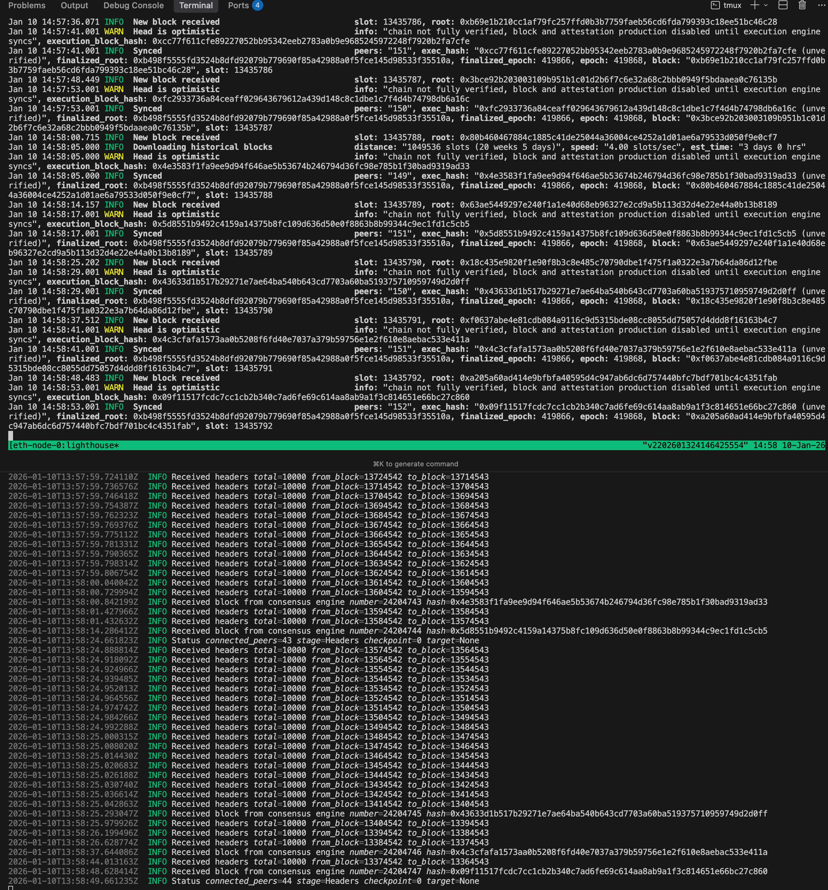

reth: https://reth.rs/run/ethereum#running-without-a-consensus-layer
```bash
reth node \
  --full \
  --chain mainnet \
  --datadir /root/code/node/eth/data \
  --http \
  --http.addr 0.0.0.0 \
  --http.port 7001 \
  --http.api "eth,net,web3,txpool,debug,trace" \
  --http.corsdomain "*" \
  --authrpc.jwtsecret /secrets/jwt.hex \
  --authrpc.addr 127.0.0.1 \
  --authrpc.port 8551 \
  --ws \
  --ws.addr 0.0.0.0 \
  --ws.port 7002 \
  --ws.api "eth,net,web3,txpool,debug,trace" \
  --ws.origins "*" \
  --ipcpath /root/code/node/eth/data/reth.ipc
```

lighthouse: https://lighthouse-book.sigmaprime.io/run_a_node.html
```bash
lighthouse bn \
  --network mainnet \
  --execution-endpoint http://localhost:8551 \
  --execution-jwt /secrets/jwt.hex \
  --checkpoint-sync-url https://mainnet.checkpoint.sigp.io
```

output: okay我们现在正在同步中

