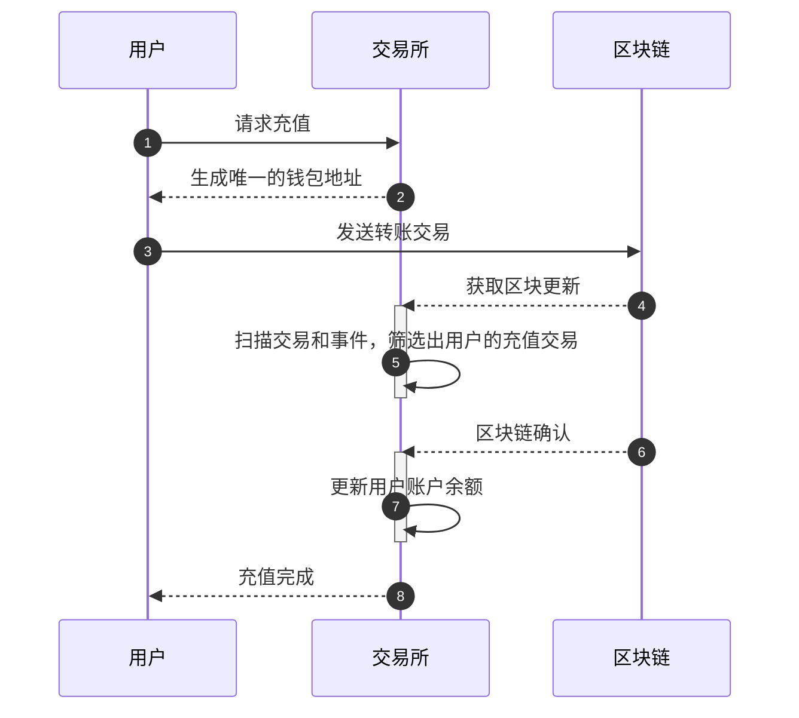
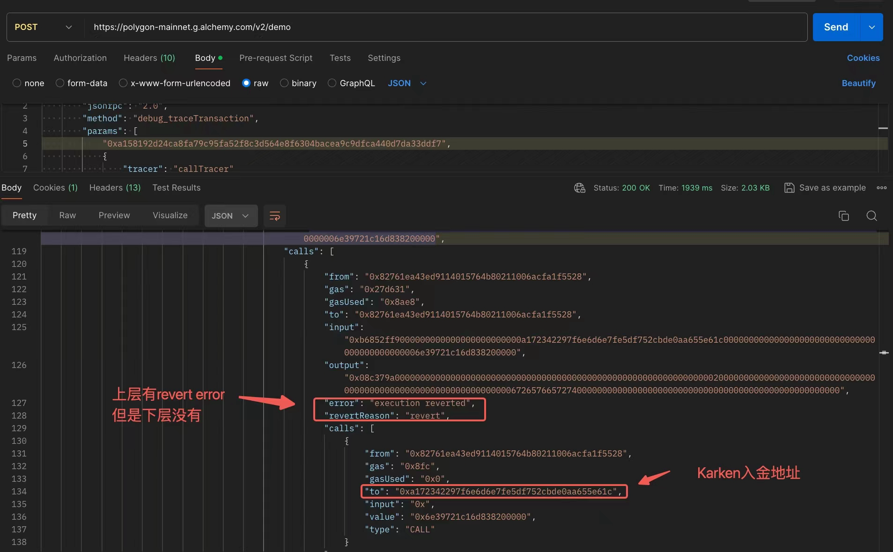

## 交易所假充值

### 充值原理解析

一个典型的流程如下：

1. 钱包地址生成：交易所为每个用户分配一个唯一的钱包地址，用于接收用户的充值。这些地址通常由交易所的系统自动生成。用户在进行充值时，需要将数字资产发送到交易所账户中的特定钱包地址。
2. 区块链账本扫描：交易所的节点会与区块链网络中的其它节点同步，以获取最新的区块链状态和交易信息。当交易所节点收到新的区块时，它会从区块包含的交易内容，或者区块触发的交易执行事件中，提取出用户的充值交易 ID 及对应的金额，加入待充值列表
3. 确认入账：交易所通常要求交易在区块链网络中获得一定数量的确认后才被视为有效。确认是指交易所在区块被一定数量的区块所引用，并被其他矿工验证和确认。交易所设定的确认数目可以根据不同的数字资产和网络而有所不同。



总结几种常见的假充值攻击手法：

| 利用模式 | 描述                                                         |
| -------- | ------------------------------------------------------------ |
| 零确认   | 充值交易出现在内存池时就为用户入账，但该交易并未被区块打包，攻击者通过替换交易（RBF）使其失效。 |
| 分叉     | 充值交易被打包到区块时就为用户入账，但由于区块链出现分叉，该交易最终被视为无效交易并丢弃。 |
| 假币     | 检测到充值交易后，未区分充值的资产类型就为用户入账，导致错误入账。 |
| 状态失败 | 充值交易被打包到区块中，但在链上执行失败，由于参数不合法导致转账逻辑未被触发，如果未检测交易的状态标志位就为用户入账则会造成假充值。 |
| 类型错误 | 一笔包含了充值地址的非转账类型交易被识别为充值交易，进而错误入账。 |
| 伪造事件 | 通过智能合约构造出与真实充值事件相似的事件，如果入账校验程序不够严谨，那么可能会出现误判，为用户充值入账。 |
| 双花     | 由于接口或数据处理问题，同一笔交易被多次入账，导致双花攻击。 |
| 锁定     | 攻击者用特殊交易对交易所进行充值，但充值的代币有一定的解锁条件，导致交易所无法掌握充值的代币，造成资产损失。 |
| API 升级 | 节点升级后对接口规范或数据结构进行了修改，如果入账程序没有进行升级，可能会造成充值检测出错，导致假充值。 |
| 抽象账户 | 一些区块链平台的用户账号可以部署智能合约，这将导致交易有更多不确定的动作。 |
| SDK 漏洞 | 使用第三方的服务解析交易，对于一些特殊交易可能解析错误，导致假充值。 |
| 专有特性 | 一些区块链的特殊设计，与主流区块链的模式存在认知上的差异，导致错误的对接。 |

### 攻击事件

#### DragonEx

TODO

#### Kraken

Kraken在2024年的时候，被发现了假充值漏洞，并且[和Certik撕逼](https://x.com/TechFlowPost/status/1803633149789995471)。

漏洞分析：这是一个Internal Tx假充值的漏洞，其只检查子动作，不验证上层动作的状态。Kraken支持合约内部转账，因此有问题。



比如黑客可以通过try-catch实现攻击：

```solidity
contract TestPoC{
    // 交易所入金地址
    address CEX_Deposit_Adress;

    function SendToCex() public payable{
        payable(CEX_Deposit_Adress).call{value: msg.value}("");
        revert();
    }

    receive() external payable{
        try this.SendToCex{value: msg.value}(){
        }catch{
            payable(msg.sender).call{value:msg.value}("");
        }
    }
}
```

一般CEX中，充值通过以下方式来监控：

- ERC20充值看Log，不需要解析trace

- Native Token需要解析Trace

可能的猜测：外层call失败的TX，会被CEX直接忽略。 内层ERC20如果假充值，因为revert了没log搞不了，但Native本来就没Log，所以有时候可以攻击。不知道kraken是不是这个原因。

#### Coinbase

https://web.archive.org/web/20180401130129/https://www.vicompany.nl/magazine/from-christmas-present-in-the-blockchain-to-massive-bug-bounty

#### Polygon

Polygon的Native Token是一个ERC20代币（他的Transfer Log Topic0不标准），他有自己的合约。然后合约有一个`transferWithSig()`函数，允许无Gas进行交易。然而这个函数使用了`ecrecovery()`验证签名，黑客可以发送不足65长度的签名，使其返回`address(0)`，而不是被`require()`检查而revert。然后调用`_transferFrom()`，这个函数没有检查`from()`的余额，因此相当于增发了。

- https://github.com/immunefi-team/polygon-transferwithsig
- https://medium.com/immunefi/polygon-lack-of-balance-check-bugfix-postmortem-2-2m-bounty-64ec66c24c7d

#### XRP

链接：

- 文章：https://finance.sina.com.cn/blockchain/coin/2018-08-08/doc-ihhkuskt5083980.shtml?cre=tianyi&mod=pcpager_fintoutiao&loc=12&r=9&doct=0&rfunc=100&tj=none&tr=9

- 在这个PR里面：https://github.com/monero-project/monero/issues/3983

核心函数 `process_new_transaction()` 在扫描交易 outputs 时，会遍历 `tx_extra` 中的 `tx_pubkey`（主 `pubkey` + `additional_tx_pub_keys`）。旧代码没有去重：

- 若 tx 含重复/多余 pubkey（例如 OpenMonero 为 2-output 交易错误添加第 2 个 key，或攻击者故意构造），同一个 output 的 key derivation 会多次成功匹配。
- 结果：同一笔 output 被计入多次 → show_transfers out/in 显示金额翻倍（示例：实际转 1 XMR 显示成 ~18M XMR），而实际钱包余额（另一个独立逻辑计算）不受影响。

攻击场景（交易所假充值）： 攻击者向交易所存款地址发 1 XMR，但 tx 里塞重复 tx_pubkey。交易所若只看 show_transfers 或 RPC 结果确认充值，就会误判收到 2 XMR 并立刻允许用户提现，导致交易所实收 1 XMR 却付出 2 XMR

修复：https://github.com/monero-project/monero/pull/3985/changes#diff-04cf14f64d2023c7f9cd7bd8e51dcb32ed400443c6a67535cb0105cfa2b62c3cR1196-R1202

原代码无条件遍历所有 additional keys → 现在仅在 if (pk_index == 1)（子地址输出）时才生成 additional_derivations。避免主地址输出被额外 keys 重复匹配。

修复效果： 每个 unique tx_pubkey 只处理一次，double counting 彻底消失。show_transfers、余额显示、交易所对接立即恢复正常，无需 rescan。额外警告日志还能帮开发者发现 malformed 交易。

#### Transfer失败返回false

有些ERC20实现，在transfer失败的时候，返回false，没有直接revert。这时候，如果交易所合约，如果没有检查其返回值的话，那么就会出问题，ERC20没有转账成功，也会进行记账。


