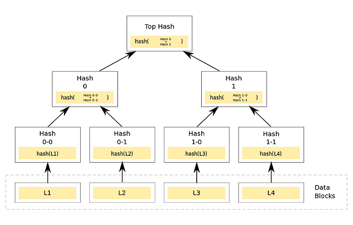
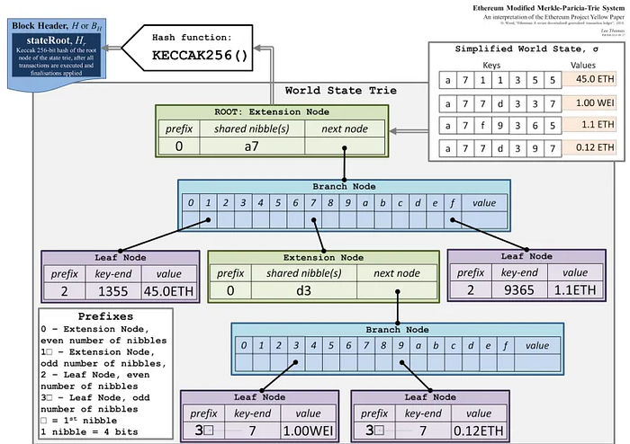
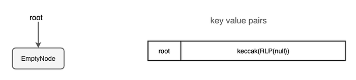
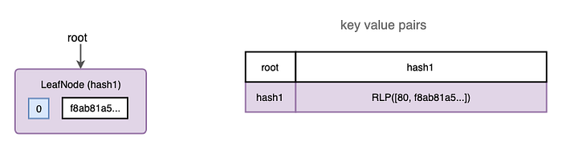
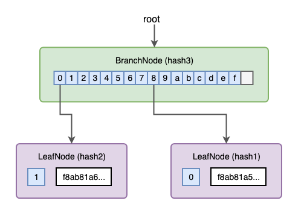
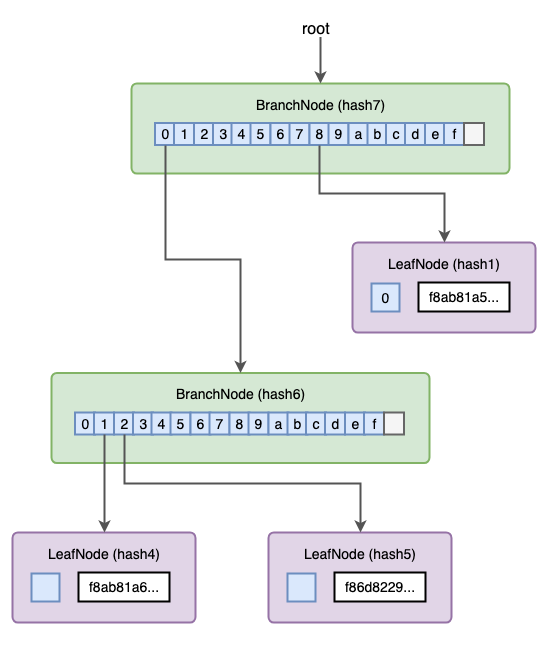
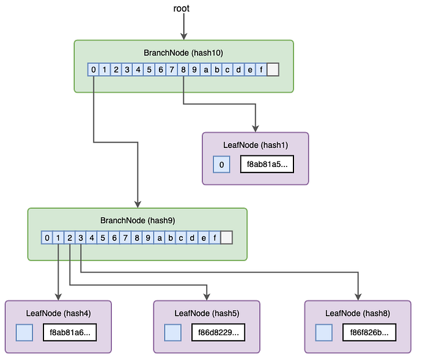
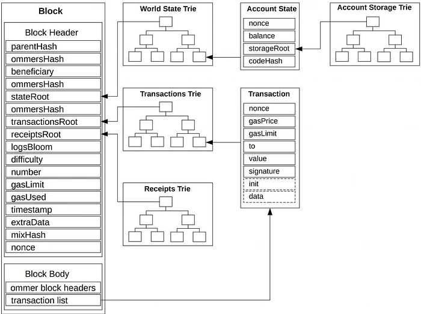
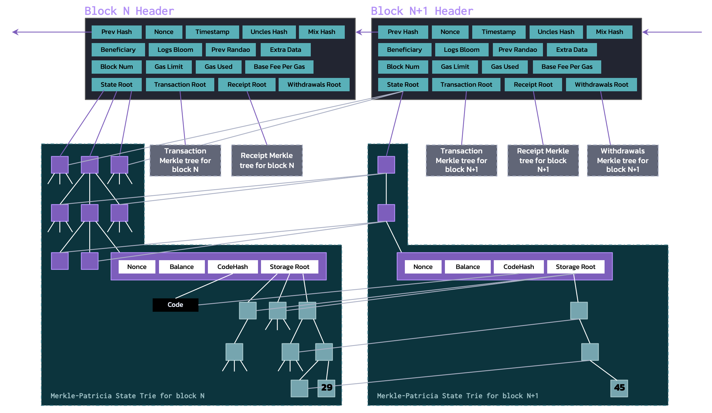
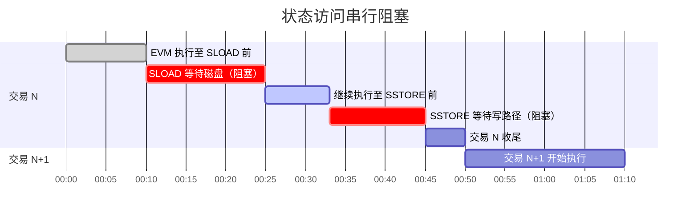

# 1. 简介

Ethereum使用MPT来存储数据。

# 2. 什么是MPT

## 2.1 基本原理

trie 是一种树状数据结构，能够高效地存储和检索键值对。



然后，Ethereum用的是一种改良的trie：Merkle Patricia Trie。原本的Merkle Tree盲目地将数据集进行分块，而Merkle Patricia Trie按照了共同前缀的方式来组织树状结构。

他有三种类型的节点：

- Branch Nodes：17个元素的数组（16个分支 + 1个节点值）
- Leaf Nodes：表示一个键值对
- Extension Nodes：当一个Branch Nodes只有一个子节点的时候，就会用Extension Nodes。MPT 不会为每个分支重复生成路径，而是将其压缩到一个Extension Nodes中，该扩展节点包含路径和子节点的哈希值。



更新trie的时候：

- 当遇到EmptyNode时，它会被一个具有剩余键路径的新Leaf Nodes替换。
- 当遇到 LeafNode 时，它会被转换为 ExtensionNode，并创建一个新的 BranchNode，该 BranchNode 有两个分支，分别指向 ExtensionNode 和一个新的 LeafNode。
- 当遇到 ExtensionNode 时，将其转换为路径更短的另一个 ExtensionNode，并创建一个新的 BranchNode，指向新的 ExtensionNode
- 创建 trie 树时，根节点指向一个EmptyNode

我们来看一个例子，来理解更新的流程。

（1）首先，我们创建一个trie树



（2）然后，添加第一笔交易的键值对时，会创建一个LeafNode，并将交易数据存储在其中。根节点会被更新，指向这个LeafNode。



（3）添加第二笔交易时，根节点处的叶节点将转换为BranchNode，该BranchNode有两个分支分别指向两个新的LeafNode。根节点现在指向新的BranchNode。



（4）添加第三笔交易时，左侧的LeafNode会转换为BranchNode，这与添加第二笔交易的过程类似。虽然根节点没有改变，但根节点的哈希值发生了变化，因为它的分支 0 指向了一个哈希值不同的节点。



（5）添加第四笔交易时，添加第三笔交易类似。现在我们可以验证根哈希值与区块中包含的 transactionRoot 完全相同。



（6）获取交易的默克尔证明：对于给定的交易，默克尔证明就是通往存储该交易值的LeafNode的路径。通过验证该证明，可以从根哈希开始遍历 trie 树，解码节点，检查每个节点的nibbles，并重复此过程，直到找到与剩余nibbles匹配的节点。如果找到，则与该键关联的值正确；如果未找到，则默克尔证明无效。

## 2.2 节点如何持久化

MPT 在逻辑上是一棵树，但物理上每个节点都单独存入一个 KV 数据库（如 LevelDB / RocksDB）。存法如下：

第一步：对节点做 RLP 编码：每个节点（Branch / Extension / Leaf）先序列化为 RLP 字节串。

第二步：按长度决定引用方式

| 节点 RLP 字节长度 | 存储方式 | 父节点引用方式 |
|-----------------|---------|--------------|
| ≥ 32 字节 | 以 `keccak256(RLP(node))` 为 Key、`RLP(node)` 为 Value 单独写入 DB | 父节点里存 32 字节的哈希指针 |
| < 32 字节 | 不单独占一条 KV，直接把 RLP 内联进父节点 | 父节点里直接嵌入子节点 RLP |

这是内容寻址的由来：节点的地址（Key）由其内容哈希决定，内容一变 Key 就变，父节点里存的指针也必须随之更新。这正是每次写入都要沿路重算所有祖先哈希的根本原因。

第三步：查找时逐层 DB.get

沿路径查找的过程等价于：

```
root_hash
  -> DB.get(root_hash)          // 取根节点 RLP，解码得到子节点哈希
  -> DB.get(child_hash_1)       // 取第二层节点
  -> DB.get(child_hash_2)       // 取第三层节点
  -> ...直到 Leaf
```

# 3. 核心的Trie



以太坊用整块头里的几个根哈希把状态、交易、收据、提款分别 Merkle 化。状态不是每块整块复制，而是改一点，从叶子到整条链的根沿路复制出一套新节点，旧块仍指向旧树根。我们来详细分析下图的含义：

Block N → Block N+1 之间画的灰线意思是：

- 没改动的子树，不复制，两边的逻辑树可以继续引用同一个物理节点（同一套 `hash → node` 存库）。
- 改动的路径上，必须从发生变更的节点开始，一路新建父节点，直到这棵子树的根，再连着往上更新 `storageRoot`、账户编码、再到 State Root，因为父节点里包含了子根的哈希：子一变，整条祖先链哈希都要变。



> 比如图里示例：存储里某个值从 29 改成 45：
>
> 1. Storage Trie 里新叶子（或改的叶子）那条路径上的节点都要新版本。
> 2. 账户 RLP 里的 Storage Root 变 → 这棵账户叶子在变。
> 3. 世界 State Trie 上从该账户叶子到 State Root 的祖先又都要新版本。
>
> 一次小更新触发多次随机读写的写放大 / 沿路哈希重算

## 3.1 World State Trie

世界状态树（World State Trie）是以太坊全网所有账户的当前快照，随每个区块更新一次，块头里的 `stateRoot` 就是其根哈希。

| | 说明 |
|--|------|
| 键（路径） | `keccak256(账户地址)`，32 字节按 nibbles 展开，共 64 位路径 |
| 叶节点值 | 账户的 RLP 编码：`[nonce, balance, storageRoot, codeHash]` |
| 演化方式 | 跨块持续演化，未修改的子树在不同区块间共享物理节点 |

## 3.2 Transaction Trie

每个区块单独构建一棵 Transaction Trie，只在出块时创建，之后不再修改。块头里存 `transactionsRoot`。

| | 说明 |
|--|------|
| 键（路径） | `RLP(交易在块内的下标)`，例如第 0 笔 → `0x80`，第 1 笔 → `0x01` |
| 叶节点值 | 传统交易：`RLP(tx)`；EIP-2718 类型化交易：`TxType \|\| encode(tx)` |
| 演化方式 | 按块独立，不跨块演化 |

## 3.3 Account Storage Trie

每个合约账户拥有一棵独立的 Storage Trie，用来存储合约的槽位（slot）数据。其根哈希是该账户在 World State Trie 叶节点里的 storageRoot 字段。

> 注意区分：账户的 `nonce`、`balance`、`codeHash` 存在 World State Trie 的账户叶子里，不在 Storage Trie 里。Storage Trie 只存合约变量（`SSTORE` 写入的槽位）。EOA 账户没有合约代码，`storageRoot` 为空树根。

| | 说明 |
|--|------|
| 键（路径） | `keccak256(bytes32(slot_index))` 按 nibbles 展开 |
| 叶节点值 | 槽位的值（RLP 编码的 256 位整数） |
| 演化方式 | 跨块持续演化，每次 `SSTORE` 触发从叶子到 storageRoot 的沿路哈希重算 |

## 3.4 Receipt Trie

每个区块单独构建一棵 Receipt Trie，存储该块内所有交易的执行结果（状态、Gas 消耗、日志等），块头里存 `receiptsRoot`。

| | 说明 |
|--|------|
| 键（路径） | `RLP(交易在块内的下标)`，与 Transaction Trie 相同 |
| 叶节点值 | 传统：`RLP([status, cumulativeGasUsed, logsBloom, logs])`；EIP-2718：`TxType \|\| ReceiptPayload` |
| 演化方式 | 按块独立，构建后不再修改 |

# 4. 性能

## 4.1 前置知识

什么是随机 I/O？为什么它的效率低？

随机 I/O 是相对顺序 I/O 说的，指的是：读/写时，下一条要访问的数据在磁盘上的逻辑块位置和上一条既不连续、也不可预测，存储系统需要反复做跳到另一片地址再去读，而不是在一片连续区域里一路扫下去。比如：

| 类型     | 大概长什么样                                                 |
| :------- | :----------------------------------------------------------- |
| 顺序 I/O | 读 `块 #100`、`#101`、`#102`…地址挨着，磁盘/SSD 可以提前读、流水线好 |
| 随机 I/O | 读 `块 #982341`、`#712`、`块 #45550021`…每次都要先定位到新地址再读一小点数据 |

回到MPT中，Trie 上一次查找路径是：

```
根哈希 → DB.get(根) → 解出分支/扩展 → 得到下一层子节点哈希 → DB.get(子哈希) → …
```

因为Kecck256是在256bit的空间随机撒点，因此这样的DB.get(hash)就是随机 I/O 在磁盘读取，不是顺序地扫下去。这会导致随机 I/O 的读写比顺序 I/O 读写慢非常多。

## 4.2 理论复杂度与放大系数

MPT 的路径由账户地址的 `keccak256` 哈希展开而来，固定为 32 字节 = 64 个 nibbles。即使有 Extension 压缩，最坏情况下路径深度仍是 64 层，实际中平均深度约为 8–12 层（取决于状态规模）。

| 操作 | 时间复杂度 | 实际 DB 操作次数（放大系数） |
|------|-----------|--------------------------|
| 单次读取（authenticated） | O(D)，D = 路径深度 | 最多 64 次随机 DB 读 |
| 单次写入 | O(D) | D 次读 + D 次新节点写 + D 次哈希计算 |
| 区块结束 flush | O(D x deltaT)，deltaT = 区块内状态变更数 | 所有脏节点序列化写盘 |

一次 `SSTORE` 触发以下流程：

1. 沿路径读取 D 个节点（D 次 DB get）
2. 修改 Leaf 节点值
3. Copy-on-write：从 Leaf 到 Root 生成 D 个全新节点（旧节点保留用于历史查询）
4. 对每个新节点重新计算 `keccak256(RLP(node))`（D 次 Keccak-256）
5. 将 D 个新节点以 `hash -> rlp(node)` 写入 DB

因此一次逻辑写入 ≈ 2D 次 DB 操作 + D 次 Keccak-256。

## 4.3 核心瓶颈

> 这是[ask-about-geth-snapshot-acceleration](https://blog.ethereum.org/2020/07/17/ask-about-geth-snapshot-acceleration)的节选判断：
>
> ```
> 目前我没有账户树的准确深度数据，但大约一年前，我们的树深度已经达到 7 层。这意味着，每次树操作（例如读取余额、写入 nonce）至少会访问 7-8 个内部节点，从而至少进行 7-8 次持久化数据库访问。LevelDB 还将数据组织成最多 7 层，因此还会额外增加访问次数。最终结果是， 一次状态访问预计会放大到 25-50 次随机磁盘访问。再加上一个数据块中所有事务涉及的状态读取和写入次数，你会得到一个非常惊人的数字。
> ```

（1）随机 I/O 与内容寻址的结构性矛盾

MPT 采用**内容寻址**：每个节点的 Key 是 `keccak256(RLP(node))`，在键空间中随机分布。底层存储（LevelDB / RocksDB）是 LSM-tree 结构，对顺序写友好，但节点 Key 的随机性完全打破了局部性：

- 读路径：从根到叶每次节点查找都是独立的随机 Key 查找，即使 LSM 有 Block Cache 和 Bloom Filter，未命中时仍需随机磁盘寻道
- 写路径：Copy-on-write 产生大量小粒度随机写，加速 LSM Compaction，进一步放大写 I/O

实验数据（OpenEthereum，随机转账负载）：

| 缓存大小 | 缓存命中率 | TPS |
|---------|-----------|-----|
| 50 MB   | 63.5%     | 1238 |
| 100 MB  | 75.8%     | 1256 |
| 500 MB  | 86.2%     | 1278 |
| 1000 MB | 87.9%     | 1292 |

缓存扩大 20 倍，命中率从 63.5% 升至 87.9%，但 TPS 仅提升 4.3%。原因是瓶颈不在命中率，而在于未命中时的随机磁盘延迟

（2）哈希重计算：写路径的 CPU 瓶颈

每次状态更新需自底向上重算路径上所有祖先节点的 Keccak-256：

- 每次计算前须先 RLP 编码整个节点
- Branch Node 含 17 个字段（16 个子哈希 + 1 个 value），RLP 编码后通常超过 500 字节
- 一个区块若含 150 笔交易，保守估计触发约 1500 次节点哈希重算；随状态树加深，这个数字快速上升

（3）单线程顺序执行：I/O 阻塞关键路径

EVM 为保证确定性，严格顺序执行交易。`SLOAD` 在等到数据返回前主线程完全阻塞，无法通过并发掩盖延迟：



CPU 和内存在 I/O 等待期间完全空转，这是 MPT 性能损失中最难通过硬件升级解决的部分。

（4）状态膨胀的雪球效应

状态增长会形成负反馈循环：状态变大 → Trie 更深 → 放大系数更大 → 热数据占比下降 → 缓存命中率下降 → 更多随机磁盘访问。这解释了为什么性能随状态规模非线性下降：

| 初始账户数 | OpenEthereum TPS（简单转账） | LMPT 优化后 TPS |
|-----------|---------------------------|----------------|
| 1M        | ~2000                     | ~3000          |
| 3M        | ~1000                     | ~2400          |
| 5M        | ~600                      | ~2100          |
| 10M       | ~300                      | ~2000          |

> 数据来源：[LMPTs: Eliminating Storage Bottlenecks for Processing Transactions](https://www.cs.toronto.edu/~fanl/papers/lmpt-icbc22.pdf)（IEEE ICBC 2022，University of Toronto）

## 4.4 优化方向与原理

（1）PathDB（Geth v1.13+）

传统 Geth 以节点哈希为 Key 存储，所有历史版本共存于同一 DB，无法高效 prune，且同路径不同版本散布在磁盘各处。

PathDB 改以节点在 Trie 中的路径为 Key（path scheme），同路径新版本直接覆盖旧版本：

- 相同路径的节点在磁盘上位置固定，顺序 I/O 替代随机 I/O
- 历史版本通过内存中的 diff layer 栈管理（默认 128 个区块滑动窗口）
- 支持高效 prune：直接删除路径对应条目，无需扫描全 DB

（2）LMPT（Layered MPT，多伦多大学 2022）

大部分 SLOAD/SSTORE 访问的是近期写入的热数据。LMPT 将状态分三层：

```
写入 -> delta MPT（内存，最新）
              | 定期合并（后台线程）
        intermediate MPT（内存）
              | 定期合并（后台线程）
        snapshot MPT（磁盘）+ flat KV store（磁盘，用于无需 Merkle 证明的快速读）
```

合并在后台线程执行，与主交易执行线程解耦，将 I/O 从关键路径移除。在 10M 账户场景下最高提升 6 倍 TPS。

（3）Erigon / Reth 的扁平化方案

Erigon 选择了另一条路：运行时不维护完整 MPT，状态直接存为扁平 KV（账户地址 → 账户数据），仅在计算区块状态根时才重建 Trie。大多数 `SLOAD` / `SSTORE` 降级为直接 KV 查找，读放大从 O(D) 降为 O(1)。

（4）Verkle Tree

MPT 的 Merkle 证明大小约为 `O(D x 16 x 32 bytes)`——每层需提供 16 个兄弟节点哈希，64 层深度下证明可达数 KB，无状态客户端（stateless client）带宽开销巨大。

Verkle Tree 用向量承诺（基于 IPA 或 KZG 多项式承诺）替代哈希指针：

- 每个内部节点可承诺 256 个子节点，树的深度大幅降低
- 证明大小与子节点数量无关，仅需 `O(log N)` 个承诺元素，压缩到约 100–150 字节
- 同时解锁无状态客户端（节点无需存储全量状态，依赖随区块分发的 witness 验证）

这是以太坊存储层的长期替代方案，也是当前路线图的核心改造之一。


# 参考资料

- https://medium.com/@ricore77.eth/understanding-ethereum-structures-world-state-trie-transaction-trie-receipts-and-account-d96ab74bb2ac
- https://blog.ethereum.org/2020/07/17/ask-about-geth-snapshot-acceleration?utm_source=chatgpt.com
