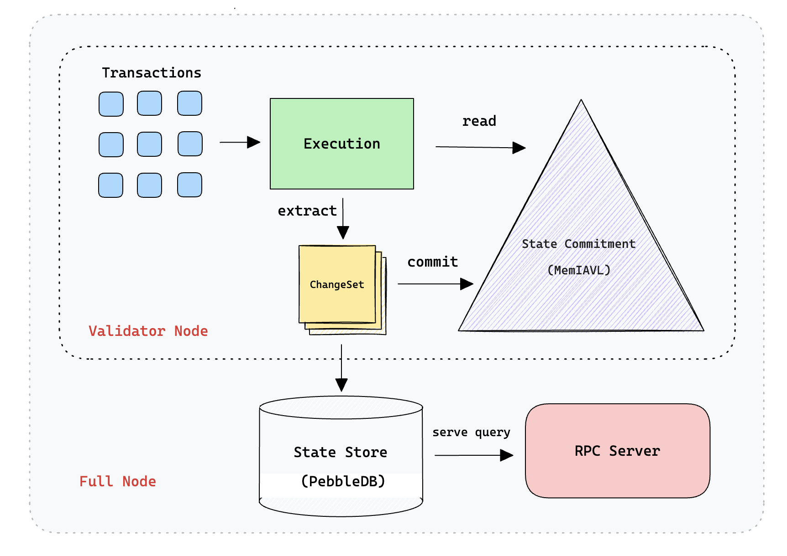
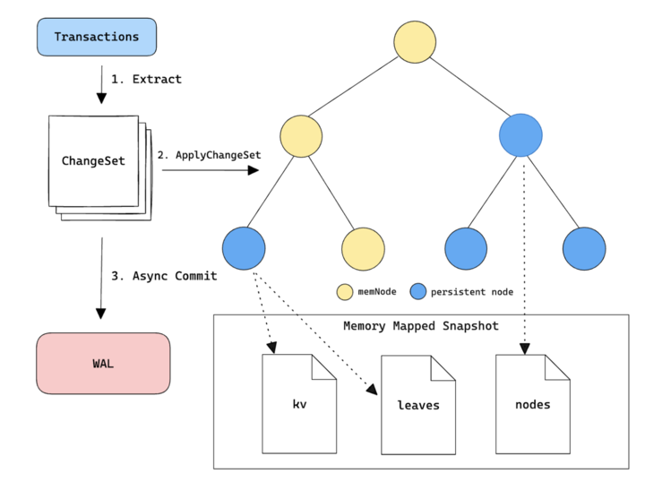
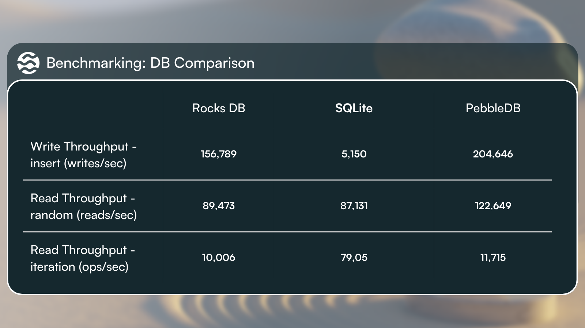

# 1. 简介

Sei 是一条基于 Cosmos SDK 构建的 EVM 兼容链，定位为并行化 EVM。提升 TPS 不只靠并行执行，存储层同样是瓶颈：状态读写慢了，执行再快也没用。

Sei 针对传统 Cosmos SDK 的 IAVL 存储方案做了系统性重构，推出 SeiDB，核心思路：把证明用的状态承诺（State Commitment）和查询用的历史数据存储（State Storage）拆成两个独立优化的层。

# 2. 传统方案：IAVL 树及其问题

## 2.1 什么是 IAVL 树

IAVL（Immutable AVL）树是 Cosmos SDK 长期以来用于状态承诺的数据结构，是一棵自平衡的 Merkle 二叉搜索树。它的功能和 Ethereum MPT 类似：

- 所有键值对按 key 有序排列形成一棵 AVL 树
- 每个节点存储其子节点哈希，从叶到根可以逐层验证（Merkle 性质）
- 树的根哈希写入区块头，供轻客户端验证状态

和 MPT 一样，IAVL 树的每个节点也以哈希为 Key存入底层 KV 数据库（LevelDB），并保留历史版本（每个区块一个版本号）。

> 普通二叉搜索树如果一直往一边长，会退化成"一条链"，高度变成 O(n)，就慢了。
>
> AVL 规定：任意节点，左右子树高度之差最多为 1。插入/删除后若不平衡，就做 旋转 把树"掰"平衡，这样树高始终压在大约 O(log⁡n)。
>
> 所以自平衡 = 树会自己通过旋转维持比较矮、比较均衡的形状，避免退化成链表。

## 2.2 IAVL 树的核心问题

随着链运行时间增长，IAVL 方案暴露出四个主要问题：

（1）写放大严重：你心里以为“写了一点点东西”，但真正写在磁盘（或 SSD）上的东西，远不止那一点点。这就叫写放大。实际写下去的体积，比你想要保存的那份“本体数据”大很多。

IAVL 的每个树节点除了存储有效数据外，还附带大量元数据（节点高度、版本号、左右子节点哈希等），这些元数据全部一起被哈希并写入 DB：

```
一个 IAVL 节点 =  有效数据 + height + version + leftHash + rightHash + ...
                  ↓
      全部 RLP 编码 → keccak256 → 作为 DB Key 写入
```

（2）历史数据增长失控

Sei v1 采用版本化 IAVL，每个区块都保留一份完整的 Merkle 树版本快照在 LevelDB 里。在测试网（atlantic-2）上，归档节点的磁盘用量增速超过 150 GB/天，约 1 TB/周。

（3）关键操作随状态增长急剧变慢

| 操作 | Sei v1 描述 |
|------|------------|
| 快照创建 | 最长需要数小时，导致节点从快照恢复后要追赶大量区块 |
| 状态同步 | 随快照体积增大，从分钟级退化到小时级 |
| 单块回滚 | 可能需要数小时 |
| 区块提交 | 随状态增大线性变慢 |

（4）LevelDB 性能随数据量退化

IAVL 节点的哈希 Key 在键空间里随机分布，导致大量随机 I/O（和 Ethereum MPT 的问题一样，参见：[以太坊 MPT 存储分析](./2026-05-11-ethereum-mpt-storage.md)）。LevelDB 针对顺序写优化，随机小粒度写让其 Compaction 频繁触发，性能随数据量非线性下降。

# 3. SeiDB：SC/SS 分离架构

SeiDB 的核心设计来自 Cosmos SDK 的 [ADR-065](https://github.com/cosmos/cosmos-sdk/blob/main/docs/architecture/adr-065-store-v2.md?ref=blog.sei.io) 方向，它的本意是：State Commitment 和 State Storage 的需求完全不同，不应塞进同一套数据结构里。

| | State Commitment (SC) | State Storage (SS) |
|--|----------------------|-------------------|
| **用途** | 计算区块根哈希、验证状态、共识 | 历史查询、RPC 服务、归档 |
| **访问模式** | 最近几个区块的热数据，频繁读写 | 随机访问任意历史高度，读多写少 |
| **需要 Merkle 证明** | 是 | 否 |
| **优化方向** | 内存操作、低延迟 | 磁盘存储效率、查询吞吐 |

```
区块到来
  |
  ├─→ SC 层（MemIAVL，内存）── 计算根哈希 ──→ 写入区块头
  |         |
  |         └── WAL 异步落盘 ──┐
  |                           ↓
  └─→ SS 层（平铺 KV，磁盘）── 存储历史版本 ──→ 响应 RPC 历史查询
```

两层可以独立优化，互不干扰。



# 4. SC 层：MemIAVL

## 4.1 核心思路

传统 IAVL 以节点哈希为 Key 存 LevelDB，每次读写都是多次随机 DB 查询。MemIAVL 改为把整棵 IAVL 树以内存映射文件（mmap）的形式保存在内存中：

- 树节点按照固定偏移量存在 mmap 区域，父子节点通过偏移量引用，而不是通过哈希查 DB
- 读取一个节点 = 直接内存寻址，延迟从「100 微秒级（LevelDB 随机读）」降到「100 纳秒级（内存访问）」
- 写入也在内存中完成，不阻塞区块提交的关键路径
- SC 层只需保留最近几个区块的状态（验证节点不需要历史数据），所以 MemIAVL 的内存占用可以控制在较小范围内，旧版本直接丢弃。历史数据的职责完全交给 SS 层。



## 4.2 持久化：WAL + Snapshot

内存树的持久化依赖两个机制：

```
内存中 MemIAVL 树
         |
         ├── 定期生成 Snapshot（快照）─→ 落盘
         |
         └── 每个区块的 changeset ─→ 异步写入 WAL（Write-Ahead Log）

崩溃恢复：加载最近一次 Snapshot + 回放 WAL 中后续的 changeset
```

WAL 写入是异步的，区块提交线程不需要等待 WAL 落盘完成——这是 SeiDB 实现 287x 区块提交延迟提升的核心原因。

# 5. SS 层：平铺 KV 存储

## 5.1 核心思路

SS 层彻底放弃 Merkle 树结构，直接把历史状态存为原始键值对：

```
Key:   storeName + version + userKey
Value: userValue（原始数据，无 Merkle 元数据）
```

不再需要存树节点的哈希和结构信息，因此：

- 写放大大幅降低：存储的全是有效数据，无额外元数据
- 利用 LSM-tree 局部性：Key 是 `(storeName, version, userKey)` 格式，同一存储的不同版本在键空间中相邻，顺序写入，LSM-tree 的 Compaction 效率更高
- 查询简单：历史版本查询直接用 `version` 范围扫描，无需遍历 Merkle 树
- 异步剪枝：历史数据清理（pruning）改为异步执行，不占用区块处理的关键路径，避免节点在 pruning 期间掉队。

## 5.2 数据库后端选择

Sei 对 RocksDB、SQLite、PebbleDB 做了基准测试（随机写、随机读、前向/后向迭代），结果是 PebbleDB 综合性能最佳，成为 SS 层的默认后端。



> PebbleDB 是 CockroachDB 团队基于 RocksDB 用 Go 重写的 LSM-tree 存储引擎，在小写入场景下延迟更低。

SS 层设计为可插拔：节点运营商可根据自身场景选择不同后端（轻节点、RPC 节点、归档节点需求不同）。

# 6. 性能数据

以下数据来自 Sei Labs 在测试网（atlantic-2）与 V2 主网的对比测试：

| 指标 | Sei v1（IAVL + LevelDB） | SeiDB（MemIAVL + PebbleDB） | 提升幅度 |
|------|--------------------------|----------------------------|---------|
| 状态同步时间 | 基准 | 显著缩短 | **+1200%** |
| 区块提交延迟 | 基准 | 近乎恒定（异步） | **287x** |
| 整体 TPS | 基准 | — | **2x** |
| 活跃状态大小 | 基准 | 减少 60% | **-60%** |
| 历史数据增长率 | ~150 GB/天 | 约 15 GB/天 | **-90%** |

区块提交延迟为何是"近乎恒定"：WAL 是异步写入，区块提交只需等 MemIAVL 内存操作完成（纳秒级），不需要等磁盘——因此延迟不随状态大小变化。

# 7. 和 Ethereum MPT 的横向对比

| 维度 | Ethereum MPT | Sei IAVL（v1） | Sei SeiDB（v2） |
|------|-------------|----------------|----------------|
| **状态承诺结构** | 16叉 Merkle Patricia Trie | 二叉 AVL Merkle 树 | MemIAVL（内存映射） |
| **节点引用方式** | 内容寻址（哈希为 Key） | 内容寻址（哈希为 Key） | 内存偏移量（SC层） |
| **读一次状态** | O(D) 次随机 DB 读，D≈8-12 | O(log N) 次随机 DB 读 | O(1) 内存访问（SC层） |
| **写放大** | 约 2-3x（路径深度相关） | 约 2.5x | 大幅降低 |
| **历史数据策略** | 节点各自管理，历史版本保留 | 版本化 IAVL 全部存 LevelDB | SS 层平铺 KV，独立优化 |
| **SC/SS 分离** | 无（Geth PathDB 接近此思路） | 无 | 是，核心架构 |
| **默认 DB 后端** | LevelDB / PebbleDB | LevelDB | SC: mmap 文件；SS: PebbleDB |

> Ethereum 社区也在探索类似分离思路：Geth 的 PathDB（路径方案）解决了随机 I/O 问题，Verkle Tree 路线图会进一步改变承诺结构。

# 8. 代码

https://github.com/sei-protocol/sei-chain/tree/main/sei-db

这是StateStore的接口：SC 管当前 working tree + Merkle + commit

```go
// StateStore is the unified interface for versioned key-value storage.
// Implemented by pebbledb/mvcc.Database, rocksdb/mvcc.Database,
// CosmosStateStore, EVMStateStore, and CompositeStateStore.
type StateStore interface {
	Get(storeKey string, version int64, key []byte) ([]byte, error)
	Has(storeKey string, version int64, key []byte) (bool, error)
	Iterator(storeKey string, version int64, start, end []byte) (DBIterator, error)
	ReverseIterator(storeKey string, version int64, start, end []byte) (DBIterator, error)
	RawIterate(storeKey string, fn func([]byte, []byte, int64) bool) (bool, error)
	GetLatestVersion() int64
	SetLatestVersion(version int64) error
	GetEarliestVersion() int64
	SetEarliestVersion(version int64, ignoreVersion bool) error
	ApplyChangesetSync(version int64, changesets []*proto.NamedChangeSet) error
	ApplyChangesetAsync(version int64, changesets []*proto.NamedChangeSet) error
	Prune(version int64) error
	Import(version int64, ch <-chan SnapshotNode) error
	io.Closer
}
```

这是State Commitment：SS 管 “按版本的原始 KV”。

```go
type Committer interface {
	Initialize(initialStores []string)

	Commit() (int64, error)

	Version() int64

	GetLatestVersion() (int64, error)

	GetEarliestVersion() (int64, error)

	ApplyChangeSets(cs []*proto.NamedChangeSet) error

	ApplyUpgrades(upgrades []*proto.TreeNameUpgrade) error

	WorkingCommitInfo() *proto.CommitInfo

	LastCommitInfo() *proto.CommitInfo

	LoadVersion(targetVersion int64, readOnly bool) (Committer, error)

	Rollback(targetVersion int64) error

	SetInitialVersion(initialVersion int64) error

	GetChildStoreByName(name string) CommitKVStore

	Importer(version int64) (Importer, error)

	Exporter(version int64) (Exporter, error)

	io.Closer
}
// ...
type CommitKVStore interface {
	Get(key []byte) []byte
	Has(key []byte) bool
	// ...
	GetProof(key []byte) *ics23.CommitmentProof
	// ...
}
```

后面所有包都是这两套接口的实现或组合。

# 9. 总结

SeiDB 的核心贡献是：把「证明状态正确」和「存储历史数据」这两件性质完全不同的事情拆开来分别优化。

- SC 层（MemIAVL）：只保留最近状态，用内存映射消灭随机磁盘 I/O，用异步 WAL 解耦提交延迟
- SS 层（平铺 KV）：放弃 Merkle 结构，原始 KV 按键有序存储，利用 LSM-tree 局部性，大幅降低写放大和存储体积

这一架构思路和 Ethereum 社区的 Erigon/Reth 扁平化方案、Geth PathDB 有相通之处，但 Sei 做得更彻底——完全分层，各自用最适合的数据库引擎，并且把历史数据的可插拔性做成了一等公民。


# 参考资料

- [SeiDB Deep Dive](https://blog.sei.io/developers/sei-db-the-numbers)（Sei Labs 官方，最详细的性能数据与架构说明）
- [Scaling the EVM from First Principles: Reimagining the Storage Layer](https://blog.sei.io/research/research-scaling-the-evm-from-first-principles-reimagining-the-storage-layer/)（Sei Research，横向对比 Ethereum / Solana / Sui / Sei 存储层）
- [sei-protocol/sei-db](https://github.com/sei-protocol/sei-db)（SeiDB 开源实现）
- [Cosmos ADR-065: Store v2](https://docs.cosmos.network/main/build/architecture/adr-065-store-v2)（SeiDB 所依据的 Cosmos SDK 架构决策）
- [Cosmos ADR-040: Storage and SMT State Commitments](https://docs.cosmos.network/sdk/latest/reference/architecture/adr-040-storage-and-smt-state-commitments)（SC/SS 分离思路的早期讨论）
- [What to do about IAVL? · cosmos/cosmos-sdk #7100](https://github.com/cosmos/cosmos-sdk/issues/7100)（Cosmos 社区对 IAVL 性能问题的详细讨论）
- [MemIAVL（Cronos 团队）](https://github.com/crypto-org-chain/cronos/wiki/MemIAVL)（MemIAVL 原始提案，由 Cronos 团队提出，Sei 在此基础上二次开发）
