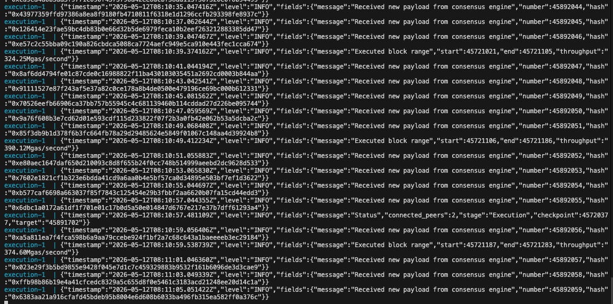
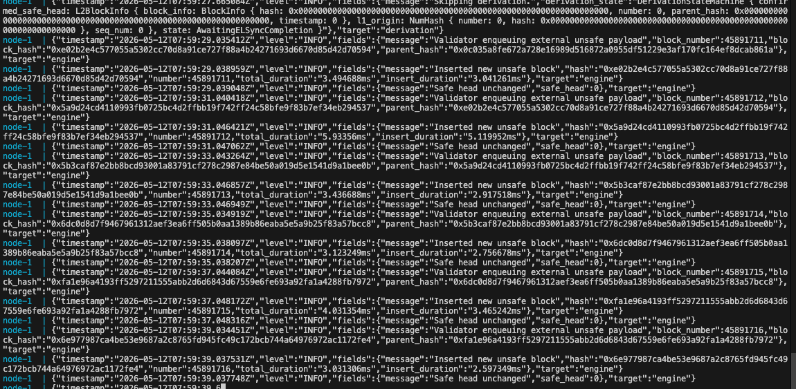

# 1. 我目前的状况

- ETH L1 已运行：

  - Reth（Execution）

  - Lighthouse（Consensus）

- JWT

```
/secrets/jwt.hex
```

# 2. 我的ETH L1运行情况

按照此[教程](https://github.com/chen4903/technical-article/blob/main/blockchain/2026-01-10-run-reth-full-node.md)，我已经同步好了，节点运行正常。

- 执行客户端

```bash
reth node \
  --full \
  --chain mainnet \
  --datadir /root/code/node/eth/data \
  --http \
  --http.addr 0.0.0.0 \
  --http.port 7001 \
  --http.api "eth,net,web3,txpool,debug,trace" \
  --http.corsdomain "*" \
  --authrpc.jwtsecret /secrets/jwt.hex \
  --authrpc.addr 127.0.0.1 \
  --authrpc.port 8551 \
  --ws \
  --ws.addr 0.0.0.0 \
  --ws.port 7002 \
  --ws.api "eth,net,web3,txpool,debug,trace" \
  --ws.origins "*" \
  --ipcpath /root/code/node/eth/data/reth.ipc
```

- 共识客户端

```bash
lighthouse bn \
  --network mainnet \
  --execution-endpoint http://localhost:8551 \
  --execution-jwt /secrets/jwt.hex \
  --checkpoint-sync-url https://mainnet-checkpoint-sync.stakely.io \
  --disable-backfill-rate-limiting \
  --http \
  --http-address 0.0.0.0 \
  --http-port 5052
```

# 3. 下载快照

进入目录：

```
cd /mnt/storage/node/base
```

下载：

> 自己在这找最新的：https://publicnode.com/snapshots。我的下载了几百G之后，就限速到1Mb+/s了
>
> 或者使用官方的：https://docs.base.org/base-chain/node-operators/snapshots#restoring-from-snapshot

```
➜ aria2c -x16 -s16 -c https://mainnet-reth-pruned-snapshots.base.org/$(curl -s https://mainnet-reth-pruned-snapshots.base.org/latest) 

05/11 17:20:44 [NOTICE] Downloading 1 item(s)
[#24929e 3.0GiB/1,073GiB(0%) CN:16 DL:268MiB ETA:1h7m55s]       
```

安装 lz4：

```
sudo apt install lz4 -y
```

解压：

```
tar -I zstd -xvf base-mainnet-pruned-reth-1778230316.tar.zst
```

解压后应出现以下等目录：

```
➜ tar -I zstd -xvf base-mainnet-pruned-reth-1778230316.tar.zst
snapshots/mainnet/download/
snapshots/mainnet/download/blobstore/
snapshots/mainnet/download/db/
snapshots/mainnet/download/db/mdbx.dat
```

下面是快照的内容：

```
➜ tree -L 1
.
├── blobstore
├── db
├── etl-tmp
├── invalid_block_hooks
├── known-peers.json
├── reth.toml
└── static_files
```

然后我们在node新建一个文件夹：`reth-data`。然后把快照内容移动到这个文件夹，做完了之后，文件夹内容大致如下：

```
# /mnt/storage/node/base/node/reth-data [main ✗ (a7f7dd0)] [10:07:02]
➜ ll
total 432K
drwxr-xr-x 2 root root 4.0K May 12 09:56 blobstore
drwxr-xr-x 2 1005 1008 4.0K May 12 03:42 db
-rw-r--r-- 1 root root   64 May 12 03:41 discovery-secret
drwxr-xr-x 2 root root 4.0K May 12 10:00 etl-tmp
drwx------ 4 root root 4.0K May 12 07:42 geth
srw------- 1 root root    0 May 12 07:52 geth.ipc
drwxr-xr-x 3 1005 1008 4.0K May  9 13:03 invalid_block_hooks
drwx------ 2 root root 4.0K May 12 07:42 keystore
-rw-r--r-- 1 1005 1008 373K May 12 04:10 known-peers.json
srwxr-xr-x 1 root root    0 May 12 09:56 reth.ipc
-rw-r--r-- 1 1005 1008 2.3K May  9 13:03 reth.toml
drwxr-xr-x 2 1005 1008  24K May 12 10:07 static_files

# /mnt/storage/node/base/node/reth-data [main ✗ (a7f7dd0)] [10:07:03]
➜ cd ..       

# /mnt/storage/node/base/node [main ✗ (a7f7dd0)] [10:07:44]
➜ git remote -v
origin  https://github.com/base/node.git (fetch)
origin  https://github.com/base/node.git (push)
```

# 4. 修改配置

- `.env`文件不变
- `.env.mainnet`：修改了这些字段，因为要对齐我本地的ETH L1

```bash
OP_NODE_L1_ETH_RPC=http://172.17.0.1:7001
OP_NODE_L1_BEACON=http://172.17.0.1:5052
OP_NODE_L1_BEACON_ARCHIVER=http://172.17.0.1:5052

BASE_NODE_L1_ETH_RPC=http://172.17.0.1:7001
BASE_NODE_L1_BEACON=http://172.17.0.1:5052
```

- `docker-compose.yml`：我将30303改成了30304，因为30303端口被我的ETH l1 Reth占用了，然后HTTP和WS的RPC分别需要访问8555和8556。并且增加了`- "9545:9545" # base-consensus RPC`

```yml
services:
  execution:
    build:
      context: .
      dockerfile: ${CLIENT:-reth}/Dockerfile
    restart: unless-stopped
    ports:
      - "8555:8545" # RPC
      - "8556:8546" # websocket
      - "7301:6060" # metrics
      - "30304:30303" # P2P TCP
      - "30304:30303/udp" # P2P UDP
    command: ["bash", "./execution-entrypoint"]
    volumes:
      - ${HOST_DATA_DIR}:/data
    environment:
      - USE_BASE_CONSENSUS=${USE_BASE_CONSENSUS:-false}
    env_file:
      - ${NETWORK_ENV:-.env.mainnet} # Use .env.mainnet by default, override with .env.sepolia for testnet
  node:
    build:
      context: .
      dockerfile: ${CLIENT:-reth}/Dockerfile
    restart: unless-stopped
    depends_on:
      - execution
    ports:
      - "7545:8545" # RPC
      - "9545:9545" # base-consensus RPC
      - "9222:9222" # P2P TCP
      - "9222:9222/udp" # P2P UDP
      - "7300:7300" # metrics
      - "6060:6060" # pprof
    command: ["bash", "./consensus-entrypoint"]
    environment:
      - USE_BASE_CONSENSUS=${USE_BASE_CONSENSUS:-false}
    env_file:
      - ${NETWORK_ENV:-.env.mainnet} # Use .env.mainnet by default, override with .env.sepolia for testnet

```

# 5. 启动

在下面的目录，执行语句来启动：

```bash
cd /mnt/storage/node/base/node
docker compose up --build
```

查看状态：`docker compose logs -f execution`



查看状态：`docker compose logs -f node`



后续同步好之后，RPC如下：

- HTTP: 

```
http://localhost:8555
```

- WS: 

```
ws://localhost:8556
```

- IPC: 

```
/mnt/storage/node/base/node/reth-data/reth.ipc
```

# 6. 常用指令

查看日志

```bash
# 查看共识层日志（op-node/base-node）
docker compose logs -f node

# 查看执行层日志（base-reth）
docker compose logs -f execution

# 两个一起看
docker compose logs -f
```

查看当前同步进度

```bash
# 查看当前最新区块号
curl -s -X POST http://localhost:8555 \
  -H "Content-Type: application/json" \
  -d '{"jsonrpc":"2.0","method":"eth_blockNumber","params":[],"id":1}' \
  | python3 -c "import sys,json; print(int(json.load(sys.stdin)['result'], 16))"

# 查看同步状态（如果返回 false 表示已同步完成）
curl -s -X POST http://localhost:8555 \
  -H "Content-Type: application/json" \
  -d '{"jsonrpc":"2.0","method":"eth_syncing","params":[],"id":1}'
```

查看共识层同步状态

```bash
curl -s -X POST http://localhost:9545 \
  -H "Content-Type: application/json" \
  -d '{"jsonrpc":"2.0","method":"optimism_syncStatus","params":[],"id":1}'
```

查看节点数

```bash
# 查看 peer 连接数（是否找到了其他节点）
curl -s -X POST http://localhost:8555 \
  -H "Content-Type: application/json" \
  -d '{"jsonrpc":"2.0","method":"net_peerCount","params":[],"id":1}'
```


