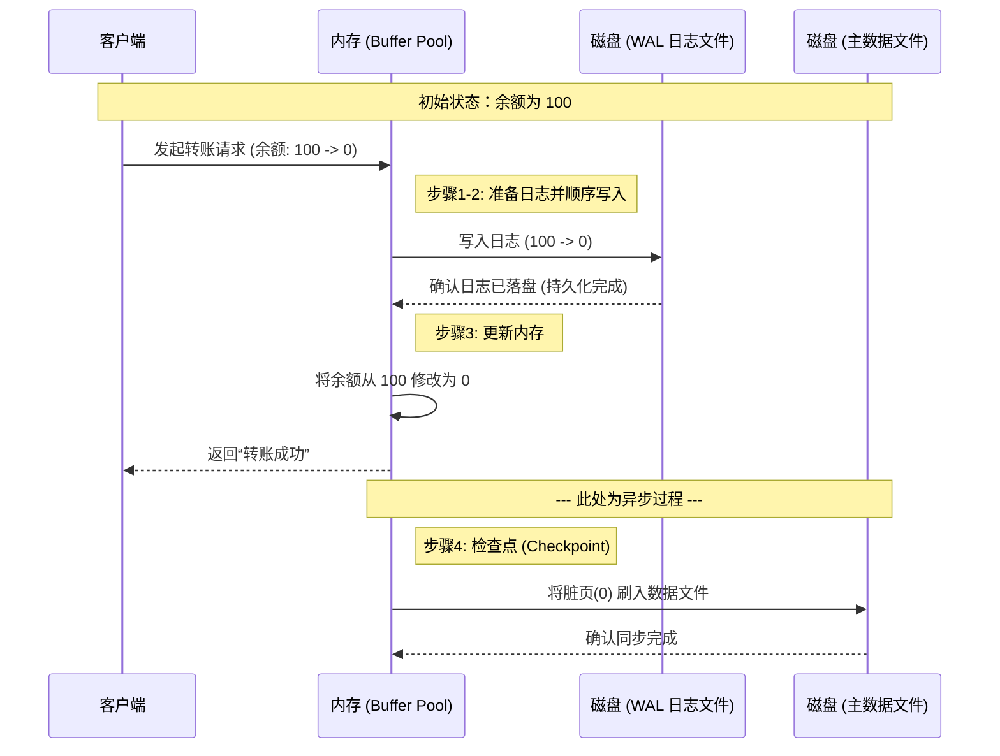
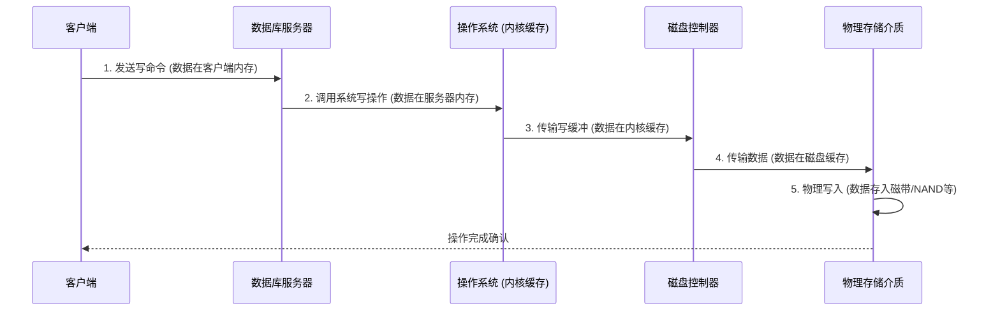
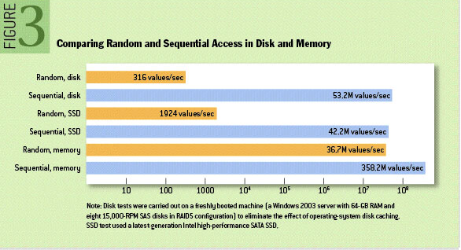

# WAL

## 1. 简介

- WAL：Write Ahead Log
- 作用：将元数据的变更操作写入磁盘之前，先写入到一个log文件中。即使系统在实际更改数据之前崩溃或发生故障，数据库依然可以通过日志来恢复一致性状态。
- 原理：通过cache合并多条“写操作”为一条，减少IO次数，并且是使用日志顺序追加的方式。
- 大致步骤如下
  1. 记录日志 (Logging)： 事务开始时，将待执行的变更封装为日志记录。
  2. 顺序写入 (WAL Write)： 将日志顺序追加到磁盘的 WAL 文件中。一旦写入成功，事务即视为“已提交”（即使主数据文件尚未更新）。
  3. 内存更新 (Memory Update)： 数据库将变更同步至内存中的数据缓存（Buffer Pool）。此时，内存中的数据页变为“脏页”。
  4. 检查点 (Checkpoint)： 定期将内存中的“脏页”批量刷入磁盘的数据文件。随着脏页被持久化，对应的旧日志即可被清理，从而缩短系统恢复时间。

实际的简单例子：以“余额 100 变 0”为例

| 步骤              | 角色 | 动作                        | 内存状态 | 磁盘状态 |
| ----------------- | -------- | ------------------------------- | ------------ | ------------ |
| 0. 初始       | 预备     | 系统将磁盘数据加载到内存        | `100`        | `100`        |
| 1. 记录       | WAL      | 在日志中写下：“余额 100 -> 0”   | `100`        | `100`        |
| 2. 顺序写     | WAL      | 将日志持久化到磁盘          | `100`        | `100 + 日志` |
| 3. 内存更新   | 内存     | 在内存中将 100 改为 0       | `0` (脏页)   | `100 + 日志` |
| 4. 提交       | 客户端   | 数据库返回“成功”                | `0`          | `100 + 日志` |
| 5. Checkpoint | 磁盘     | 定期将内存的 `0` 刷入主数据文件 | `0`          |              |

## 2. 背景知识

我们先来了解一下，用户进程是如何将数据写入到磁盘的。我们先来看看Redis之父Antries的语录：

> 1: The client sends a write command to the database (data is in client’s memory).
>
> 2: The database receives the write (data is in server’s memory).
>
> 3: The database calls the system call that writes the data on disk (data is in the kernel’s buffer).
>
> 4: The operating system transfers the write buffer to the disk controller (data is in the disk cache).
>
> 5: The disk controller actually writes the data into a physical media (a magnetic disk, a Nand chip, …).

翻译出来就是：

如果数据库挂了，这时候操作系统是可以正常工作的。只有当第三步完成之后，才能保证数据的安全写入，因为剩下的都可以由操作系统来完成。

## 3. 性能

我们需要先理解什么是Disk和SSD：

| 特性     | Disk (HDD/机械硬盘)               | SSD (固态硬盘/闪存)           |
| ------------ | ------------------------------------- | --------------------------------- |
| 工作原理 | 依靠磁头旋转、寻道（物理移动）        | 依靠电子信号（电路开关）          |
| 随机访问 | 极慢 (需要等待盘片旋转和磁头移动) | 极快 (没有移动部件，电子寻址) |
| 比喻     | 像在图书馆里亲自跑去不同书架找书  | 像在电脑里一键搜索电子文档    |

然后我们来看看6种不同的读写方式的速度对比：

WAL是顺序读写磁盘文件，它的读写速度甚至优于内存的随机读写。

## 4. 优缺点

优点

- 读写性能得到提升，并且可靠
- 操作简单

缺点

- 不适合大量数据的读取

## 5. 应用

- RocksDB：每次写操作（如Put或Delete）先写入WAL，再将数据写入MemTable。即使在系统崩溃时，RocksDB也能通过重放WAL恢复到最近一次一致的状态。这种机制使得 WAL 成为确保数据可靠性和一致性的关键。
- MySQL：WAL机制通过InnoDB存储引擎的redo log实现，数据的修改先写入redo log，随后在后台异步将数据写入实际的数据文件。即使发生崩溃，系统也可以通过 redo log 重做所有已提交但尚未持久化的事务。

## 6. 引申

WAL修改数据之前，先写日志的思想，不仅仅在数据库中可以用到，在我们日常的应用开发中，也可以用这样的思想。

- 前端数据保存和恢复在复杂的前端表单应用中，用户填写数据的时候，浏览器可能会意外刷新或关闭，导致数据丢失。我们可以将用户每次输入的内容保存到浏览器的本地存储localStorage中。如果页面刷新，可以从日志中恢复数据，确保用户体验的一致性。
- 移动应用的离线数据同步在网络不稳定或离线场景下，移动应用需要保存用户操作并在网络恢复时进行同步。利用WAL的思路，我们可以将用户的操作先记录到本地日志文件中，并在网络恢复时重放这些日志，以确保数据的一致性和正确性。

## 参考

- https://loufengman.github.io/2020/02/26/WAL%E6%9C%BA%E5%88%B6%E8%A7%A3%E6%9E%90/
- https://gemini.google.com/app
- https://zhuanlan.zhihu.com/p/719781420

